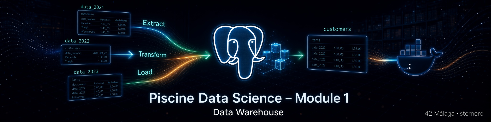
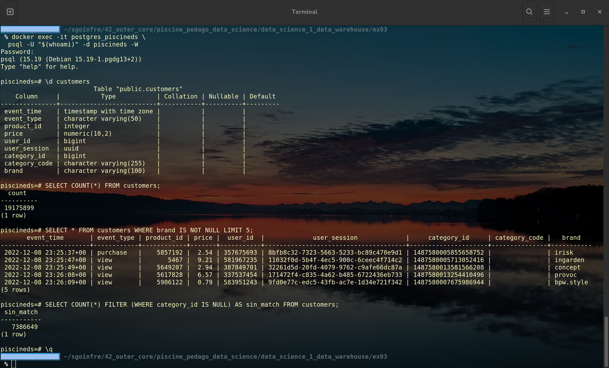
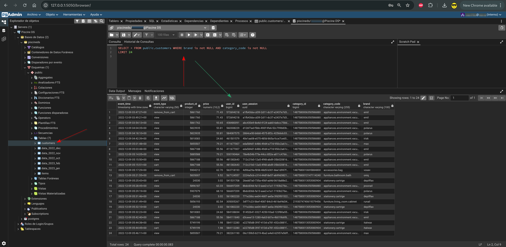

# 📊 Piscine Data Science – Module 1 – Data Warehouse

<p align="center">
  <a href="https://www.42malaga.com/" target="_blank" rel="noopener noreferrer"></a>
  <a href="https://www.python.org/" target="_blank" rel="noopener noreferrer"></a>
  <a href="https://www.postgresql.org/" target="_blank" rel="noopener noreferrer"></a>
  <a href="https://www.docker.com/" target="_blank" rel="noopener noreferrer"></a>
  <a href="https://www.gnu.org/software/bash/" target="_blank" rel="noopener noreferrer"></a>
  <a href="https://www.pgadmin.org/" target="_blank" rel="noopener noreferrer"></a>
  <a href="https://www.ibm.com/think/topics/data-warehouse" target="_blank" rel="noopener noreferrer"></a>
</p>

<p align="center">
  
</p>

<p align="center">
  <strong>ETL · customers · deduplicación · fusión con items</strong><br>
  <em>Training Piscine datascience – 1 · Version 1.1</em>
</p>

---

<a id="indice"></a>
## 📑 Índice

1. [¿De qué trata este módulo?](#proyecto)
2. [ETL en una frase](#etl)
3. [Estructura del repositorio](#estructura)
4. [Prerrequisito: Module 0](#prereq)
5. [Orden de trabajo (subject)](#orden)
6. [Qué entrega cada ejercicio](#entregas)
7. [Asistente global (`./start.sh`)](#asistente-global)
8. [Asistentes por ejercicio](#asistentes-ex)
9. [Guías didácticas](#guias)
10. [Cómo arrancar el entorno](#entorno)
11. [Comprobar el almacén](#comprobar)
12. [Guía de evaluación (`evaluation.sh`)](#evaluation)
13. [Checklist subject](#checklist)
14. [Navegación](#navegacion)

---

<a id="proyecto"></a>
## 🎯 ¿De qué trata este módulo?

El subject de **Data Warehouse** pide construir, sobre la base **`piscineds`** del Module 0, un almacén de eventos de clientes listo para analizar:

| Paso | Idea |
|------|------|
| **EX00** | Ver y buscar en la BD con una GUI cómoda |
| **EX01** | Reunir todos los meses `data_202*` en una sola tabla **`customers`** |
| **EX02** | Limpiar duplicados y ecos a **1 segundo** |
| **EX03** | Enriquecer **`customers`** con el catálogo **`items`** sin perder filas |

Al final, `customers` concentra el historial de eventos **más** categoría/marca del producto, sin basura de servidor tartamudo y sin tirar eventos huérfanos.

> ⚠️ Aviso del PDF: aunque valides un módulo, si no limpias ni almacenas bien los datos, te puedes quedar bloqueado más adelante en la piscine.

[↑ Volver al índice](#indice)

---

<a id="etl"></a>
## 🔄 ETL en una frase

**ETL** = *Extract, Transform, Load*:

```text
  data_2022_oct … data_2023_feb     items
           \         /                 |
            \       /                  |
             v     v                   v
          EXTRACT ────────► TRANSFORM ────────► LOAD
                     (UNION, DELETE,          tabla
                      LEFT JOIN)            customers
```

- **Extract**: leer tablas mensuales y catálogo ya cargados en PostgreSQL.  
- **Transform**: apilar, deduplicar, fusionar.  
- **Load**: dejar el resultado en **`customers`** dentro de `piscineds`.

[↑ Volver al índice](#indice)

---

<a id="estructura"></a>
## 📁 Estructura del repositorio

```text
data_science_1_data_warehouse/
├── README.md                 ← este archivo
├── start.sh                  ← asistente GLOBAL (recomendado)
├── evaluation.sh             ← guía interactiva de defensa
├── imgs/
├── ex00/                     ← Show me your DB
│   ├── README.md
│   └── start.sh
├── ex01/                     ← customers table
│   ├── README.md
│   ├── customers_table.sql   ← entrega
│   ├── customers_table.py    ← entrega
│   ├── sql.md · python.md
│   └── start.sh
├── ex02/                     ← remove duplicates
│   ├── README.md
│   ├── remove_duplicates.sql ← entrega
│   ├── remove_duplicates.py  ← entrega
│   ├── sql.md · python.md
│   └── start.sh
└── ex03/                     ← fusion
    ├── README.md
    ├── fusion.sql            ← entrega
    ├── fusion.py             ← entrega
    ├── sql.md · python.md
    └── start.sh
```

Los `start.sh` y las guías **no sustituyen** los ficheros de entrega del subject.

[↑ Volver al índice](#indice)

---

<a id="prereq"></a>
## 🔗 Prerrequisito: Module 0

Antes de EX01–EX03, en PostgreSQL debe existir como mínimo:

| Elemento | Origen típico |
|----------|----------------|
| Contenedor `postgres_piscineds` en `localhost:5432` | Module 0 `ex00` |
| Tablas `data_2022_*` / `data_2023_*` | Module 0 carga CSV |
| Tabla **`items`** | Module 0 EX04 |
| Credenciales | login / `mysecretpassword` / `piscineds` |

Repo hermano: [`data_science_0_creation_db`](https://github.com/STC71/42_data_science_0_creation_db) (o ruta local equivalente).

```bash
docker ps | grep postgres_piscineds
docker exec -it postgres_piscineds \
  psql -U "$(whoami)" -d piscineds -c '\dt'
```

[↑ Volver al índice](#indice)

---

<a id="orden"></a>
## 🚀 Orden de trabajo (subject)

| # | Ejercicio | Qué haces | Resultado |
|---|-----------|-----------|-----------|
| 0 | **[EX00](ex00/README.md)** | GUI fácil de usar y de buscar por ID | Visualización |
| 1 | **[EX01](ex01/README.md)** | Apilar todos los `data_202*` | **`customers`** |
| 2 | **[EX02](ex02/README.md)** | Borrar duplicados y ecos ≤ 1 s | **`customers`** limpia |
| 3 | **[EX03](ex03/README.md)** | `LEFT JOIN` con **`items`** | **`customers`** + catálogo |

El orden **no es intercambiable**.

[↑ Volver al índice](#indice)

---

<a id="entregas"></a>
## 📦 Qué entrega cada ejercicio

| Carpeta | Ficheros del subject | Idea técnica |
|---------|----------------------|--------------|
| [`ex00/`](ex00/README.md) | Demo GUI en defensa | **pgAdmin** |
| [`ex01/`](ex01/README.md) | **`customers_table.*`** | `UNION ALL` → `customers` |
| [`ex02/`](ex02/README.md) | **`remove_duplicates.*`** | `DELETE` + `LAG` ≤ 1 s |
| [`ex03/`](ex03/README.md) | **`fusion.*`** | `LEFT JOIN` items → `customers` |

Nombres de carpetas y archivos: **exactos** como en el PDF.

[↑ Volver al índice](#indice)

---

<a id="asistente-global"></a>
## 🎛️ Asistente global (`./start.sh`)

En la **raíz** del proyecto (mismo espíritu que Module 0):

```bash
chmod +x start.sh
./start.sh
# o desde cualquier directorio:
/ruta/a/data_science_1_data_warehouse/start.sh
```

### Independiente de los `start.sh` de cada `ex/`

- **No exige** `ex00/start.sh` … `ex03/start.sh`.
- Flujo integrado: estado, levantar PostgreSQL (Module 0), EX01–EX03 (`.py` o `.sql`), `COUNT`, `psql`, checklist de entregables.
- Si existen los asistentes por ejercicio, el menú ofrece **atajos opcionales** (a–d).

### Menú (resumen)

| Opción | Acción |
|--------|--------|
| 1 | Estado (Module 0, Docker, **pgAdmin**, tablas) |
| 2 | Levantar **PostgreSQL + pgAdmin** |
| g | Solo **pgAdmin** (`http://localhost:5050`) |
| p | `chmod +x` scripts conocidos |
| 3–5 | Pipeline EX01 → EX02 → EX03 |
| 6–7 | COUNT / `\d` y `psql` |
| 8 | Verificar entregables del subject |
| **e** | Preparar **`repo_<login>`** (lista blanca, sin `.env`) |
| **0** | Git asistido (push **default N**; `update-index +x`) |
| 9 | Recordatorio de defensa |
| a–d | Atajos a `ex0X/start.sh` si existen |
| q | Salir |

### Permisos +x

Tras un `git clone`, si aparece `Permission denied`:

```bash
./start.sh   # opción p, o confirmación al arrancar
# o en Git, para clones futuros:
git update-index --chmod=+x start.sh
git update-index --chmod=+x ex01/customers_table.py
git update-index --chmod=+x ex02/remove_duplicates.py
git update-index --chmod=+x ex03/fusion.py
# … y los start.sh que quieras ejecutables
```

[↑ Volver al índice](#indice)

---

<a id="asistentes-ex"></a>
## 🧩 Asistentes por ejercicio (opcionales)

| Script | Rol |
|--------|-----|
| [`ex00/start.sh`](ex00/start.sh) | GUI / entorno local EX00 |
| [`ex01/start.sh`](ex01/start.sh) | Menú EX01 |
| [`ex02/start.sh`](ex02/start.sh) | Menú EX02 |
| [`ex03/start.sh`](ex03/start.sh) | Menú EX03 |

Si no los usas, el **[`./start.sh`](./start.sh) de la raíz** cubre el recorrido.

[↑ Volver al índice](#indice)

---

<a id="guias"></a>
## 📘 Guías didácticas

Empiezan por conceptos básicos (sin asumir SQL/Python) y luego detallan cada script:

| Ejercicio | SQL | Python |
|-----------|-----|--------|
| EX01 | [ex01/sql.md](ex01/sql.md) | [ex01/python.md](ex01/python.md) |
| EX02 | [ex02/sql.md](ex02/sql.md) | [ex02/python.md](ex02/python.md) |
| EX03 | [ex03/sql.md](ex03/sql.md) | [ex03/python.md](ex03/python.md) |

[↑ Volver al índice](#indice)

---

<a id="entorno"></a>
## 🖥️ Cómo arrancar el entorno

```bash
# Module 0
cd ruta/a/data_science_0_creation_db/ex00
docker-compose up -d

# Module 1 – asistente global
cd ruta/a/data_science_1_data_warehouse
./start.sh
```

Ejecución directa del pipeline:

```bash
cd ex01 && python3 customers_table.py
cd ../ex02 && python3 remove_duplicates.py   # varios minutos
cd ../ex03 && python3 fusion.py
```

[↑ Volver al índice](#indice)

---

<a id="comprobar"></a>
## ✅ Comprobar el almacén

```bash
docker exec -it postgres_piscineds \
  psql -U "$(whoami)" -d piscineds -W
```

```sql
\dt
SELECT COUNT(*) FROM customers;
\d customers
-- Tras EX03: category_id, category_code, brand
SELECT * FROM customers WHERE brand IS NOT NULL LIMIT 5;
\q
```
<p align="center">
  
</p>

<p align="center">
  
</p>

[↑ Volver al índice](#indice)

---

<a id="evaluation"></a>
## 🧪 Guía de evaluación (`evaluation.sh`)

La guía [`evaluation.sh`](./evaluation.sh) está basada en
[`evaluation_en.pdf`](./evaluation_en.pdf) y [`en.subject.pdf`](./en.subject.pdf).
Reproduce el orden de la defensa y muestra los comandos utilizados para que el
evaluador pueda comprobarlos y discutirlos con el evaluado.

Antes de ejecutarla:

1. Clona el repositorio en una carpeta vacía.
2. Asegúrate de que PostgreSQL del Module 0 está disponible en
   `localhost:5432`, con la base `piscineds`.
3. Descarga el adjunto `data_2023_feb.csv` desde Attachments de la evaluación.
4. Déjalo en la raíz de este módulo, junto a `ex00/`…`ex03/`, y cárgalo como
   tabla `data_2023_feb` antes de EX01.
5. Carga también `data_2023_feb.csv` como tabla **`data_2023_feb`**.
6. Mantén las cinco tablas fuente requeridas del almacén:
   `data_2022_oct`, `data_2022_nov`, `data_2022_dec`, `data_2023_jan` y
   `data_2023_feb`, además de `items`; son el estado previo que exige la
   evaluación de EX00/EX01.

Ejecución:

```bash
chmod +x evaluation.sh
./evaluation.sh
```

La guía comprueba de forma dinámica la carpeta donde está ubicado el script,
Docker/PostgreSQL, pgAdmin, el estado inicial de tablas,
los entregables exactos y los criterios cuantitativos de la escala:

- EX01: `customers` debe tener exactamente `20,692,840` filas.
- EX02: comprueba los dos ejemplos de duplicados/ecos del PDF, el caso que no
  debe borrarse y el rango `18,500,000`–`19,200,000`.
- EX03: comprueba `product_id = 5846774`, sus valores de catálogo y que no se
  pierdan filas.

Si el preflight detecta un problema, no se limita a mostrar un error:

- Si Docker no está instalado o no está disponible, explica que debe iniciarse
  el motor y volver a ejecutar la guía.
- Si `postgres_piscineds` no está arrancado, pregunta antes de ejecutar
  `docker compose up -d` desde `data_science_0_creation_db/ex00/`, muestra el
  comando y vuelve a comprobar el contenedor.
- Si el contenedor está activo pero PostgreSQL no acepta la conexión, muestra
  `docker logs postgres_piscineds`, recuerda revisar `ex00/.env` y ofrece un
  reintento tras esperar a que el servidor termine de iniciar.
- Si pgAdmin no responde en `http://localhost:5050`, ofrece abrir el asistente
  `data_science_0_creation_db/ex01/start.sh`, muestra el comando y vuelve a
  comprobar el código HTTP. Si sigue fallando, indica revisar el proceso, el
  puerto 5050 y `pgAdmin.md`.

Ninguna recuperación se ejecuta silenciosamente: cada acción requiere
confirmación y se comprueba de nuevo antes de continuar.

La tabla `data_2023_feb` debe estar ya cargada en PostgreSQL al comenzar: el
CSV en la carpeta del repositorio y la tabla en el contenedor son dos cosas
distintas. `evaluation.sh` comprueba ambas y detiene la evaluación si falta
cualquiera de ellas.

Si el CSV existe en la raíz pero falta la tabla `data_2023_feb`, la guía ofrece
cargarla desde el propio script. Antes de hacerlo muestra y solicita confirmar:

```bash
docker exec -i postgres_piscineds \
  sh -c 'cat > /tmp/data_2023_feb.csv' \
  < data_2023_feb.csv
```

y el SQL que ejecutará:

```sql
DROP TABLE IF EXISTS data_2023_feb;
CREATE TABLE data_2023_feb (
  event_time TIMESTAMPTZ,
  event_type VARCHAR(50),
  product_id INTEGER,
  price NUMERIC(10,2),
  user_id BIGINT,
  user_session UUID
);
COPY data_2023_feb
FROM '/tmp/data_2023_feb.csv'
WITH (FORMAT csv, HEADER true);
```

Después consulta `COUNT(*)` y solo continúa si la tabla queda disponible.
Los demás meses no se fabrican ni se cargan sin sus CSV de origen: si falta
alguno, la guía indica recuperar esos datos mediante Module 0/pgAdmin.

Si detecta `customers`, `customers_fused` o cualquier otra tabla fuera de la
lista blanca `data_202*` e `items`, las muestra y ofrece eliminarlas mostrando
primero el comando exacto. El borrado se limita al esquema `public` y utiliza
`format('%I', tablename)` para citar identificadores de forma segura; nunca
elimina tablas fuente ni `items`. Si se rechaza la limpieza, la guía marca la
parada oficial de EX00 y no continúa simulando EX01–EX03 sobre un estado
contaminado.

La respuesta HTTP de pgAdmin (`http://localhost:5050`) no se considera por sí
sola una demostración válida. En este proyecto la demostración se hace
exclusivamente con pgAdmin:

1. Abre `http://localhost:5050`.
2. Expande `Servers → PostgreSQL → Databases → piscineds → Schemas → public → Tables`.
3. Abre `Query Tool` sobre una tabla `data_202*`.
4. Ejecuta, por ejemplo:

   ```sql
   SELECT product_id, event_type, event_time
   FROM data_2022_oct
   WHERE product_id = 5846774
   LIMIT 10;
   ```

5. Muestra las filas en `Data Output` y la conexión configurada con
   `localhost:5432`, base `piscineds` y el usuario del proyecto.

`evaluation.sh` muestra estas acciones, el comando equivalente de comprobación
por terminal y solicita confirmación explícita. Si no se demuestra la conexión
real y la búsqueda por ID, la evaluación se detiene conforme al PDF.

Después de limpiar `customers`/`customers_fused`, `evaluation.sh` no ejecuta
pregunta explícitamente si debe recrearlos. Si se confirma, ofrece cada paso en
orden y, antes de ejecutarlo, muestra:

- el fichero Python y el fichero SQL equivalentes;
- el comando exacto para ejecutar cada alternativa;
- la localización dinámica de las líneas principales donde se realiza la
  operación (no depende de números de línea fijos);
- qué técnica se está utilizando, por qué es adecuada y qué resultado debe
  producir;
- una explicación breve, completa y, cuando ayuda, una analogía cotidiana;
- una elección explícita entre Python, SQL u omitir el paso.

Por ejemplo, EX01 puede ejecutarse así:

```bash
cd /ruta/al/data_science_1_data_warehouse/ex01
python3 customers_table.py
```

o directamente mediante PostgreSQL:

```bash
docker exec -i postgres_piscineds \
  psql -U sternero -d piscineds \
  < /ruta/al/data_science_1_data_warehouse/ex01/customers_table.sql
```

El mismo flujo se ofrece para `ex02/remove_duplicates.py` /
`remove_duplicates.sql` y `ex03/fusion.py` / `fusion.sql`. Si se rechaza la
ejecución guiada, se muestran los comandos de `ex01/start.sh`,
`ex02/start.sh` y `ex03/start.sh` para ejecutarlos manualmente. Al terminar
los tres ejercicios, la guía verifica el resultado en la misma ejecución; si
se omite algún paso, los errores de ese ejercicio son esperables y habrá que
volver a ejecutar `evaluation.sh` tras completarlo. Tras cada pausa limpia la
terminal y muestra el último resultado con color e icono. La decisión oficial
sigue siendo la de la escala Intra y el evaluador.

Las comprobaciones se hacen en el momento correcto: EX01 se comprueba
inmediatamente después de crear `customers`, antes de que EX02 reduzca sus
filas; EX02 se comprueba después de la limpieza y EX03 después de la fusión.
Así el resumen final conserva el resultado real de cada ejercicio y no vuelve
a evaluar EX01 contra la tabla ya transformada por EX02. La cabecera que
aparece después de pulsar Enter es un redibujado de la interfaz, no un reinicio
del script.

[↑ Volver al índice](#indice)

---

<a id="checklist"></a>
## ✅ Checklist subject

| Ítem | ☐ |
|------|---|
| **EX00** – GUI fácil de usar y de buscar por ID | ☐ |
| **EX01** – Tabla **`customers`** con todos los `data_202*` | ☐ |
| **EX01** – Entrega `ex01/customers_table.*` | ☐ |
| **EX02** – Duplicados / ecos ≤ 1 s eliminados | ☐ |
| **EX02** – Entrega `ex02/remove_duplicates.*` | ☐ |
| **EX03** – Fusión con `items` **sin perder información** | ☐ |
| **EX03** – Entrega `ex03/fusion.*` | ☐ |
| Nombres de carpetas y ficheros según el PDF | ☐ |
| `data_2023_feb.csv` descargado desde Attachments y cargado como `data_2023_feb` | ☐ |
| Trabajo en el repositorio Git asignado | ☐ |
| Puedes demostrar el flujo en la máquina del evaluado | ☐ |

[↑ Volver al índice](#indice)

---

<a id="navegacion"></a>
## 🔗 Navegación

| | |
|--|--|
| **[EX00 – Show me your DB](ex00/README.md)** | GUI y búsqueda por ID |
| **[EX01 – customers table](ex01/README.md)** | `UNION ALL` → `customers` |
| **[EX02 – remove duplicates](ex02/README.md)** | Limpieza `LAG` ≤ 1 s |
| **[EX03 – fusion](ex03/README.md)** | `LEFT JOIN` con `items` |
| **[./start.sh](./start.sh)** | Asistente global del módulo |

---

<p align="center">
  <em>Piscine Data Science – Module 1 – Data Warehouse</em><br>
  <strong>sternero – 42 Málaga – Octubre 2026</strong>
</p>
