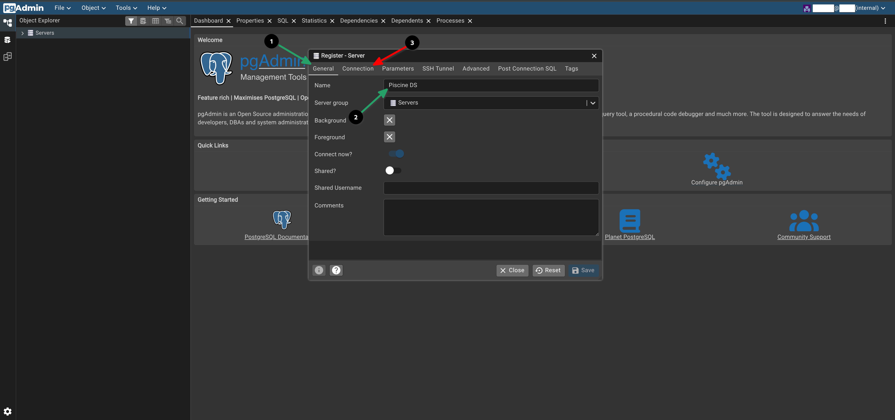
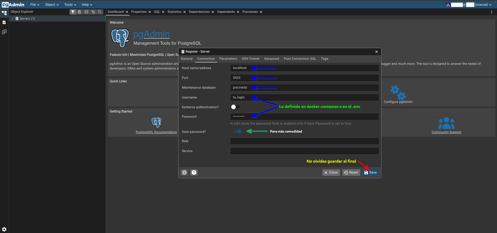
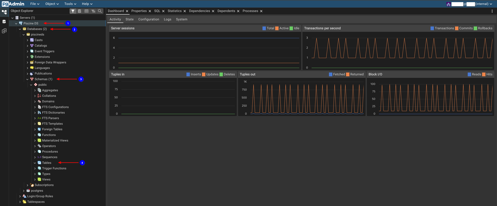
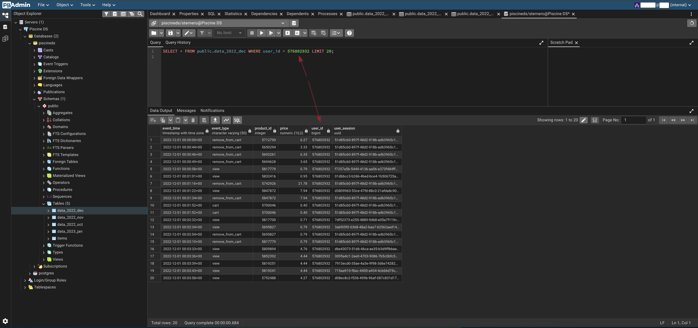

# 🖥️ Ejercicio 00 – Show me your DB

<p align="center">
  
</p>

[← Volver al README principal](../README.md)

---

<a id="indice"></a>
## 📑 Índice

1. [¿Qué se pide exactamente?](#que-se-pide)
2. [Archivos a entregar](#archivos)
3. [Explicación sencilla](#explicacion)
4. [Herramientas permitidas](#herramientas)
5. [Relación con Module 0](#module-0)
6. [Conexión a PostgreSQL](#conexion)
7. [Asistente `start.sh`](#start)
8. [Cómo saber que está bien](#comprobar)
9. [Checklist](#checklist)
10. [Navegación](#navegacion)

---

<a id="que-se-pide"></a>
## 🎯 ¿Qué se pide exactamente?

Según el subject de **Data Warehouse**:

| Punto | Detalle |
|-------|---------|
| Directorio | `ex00/` |
| Objetivo | Ver la base de datos **de forma fácil** con un software gráfico |
| Uso | Debe ser cómodo para **buscar por ID** |
| Herramientas | pgAdmin, Postico, DBeaver **u otra** similar |

No se exige un fichero de código concreto. En la evaluación debes **demostrar** la herramienta abierta y conectada a `piscineds`.

[↑ Volver al índice](#indice)

---

<a id="archivos"></a>
## 📁 Archivos a entregar

La carpeta `ex00/` puede estar casi vacía. Lo importante es la **demo en vivo**.

En este repo, de ayuda (opcionales):

| Archivo | Rol |
|---------|-----|
| [`README.md`](./README.md) | Esta guía |
| [`start.sh`](./start.sh) | Comprueba PostgreSQL y arranca pgAdmin si ya está instalado |

No hace falta reimplementar el instalador de pgAdmin: se reutiliza el de **Module 0** si ya lo tienes.

[↑ Volver al índice](#indice)

---

<a id="explicacion"></a>
## 🧠 Explicación sencilla

Module 1 trabaja sobre el **mismo almacén** que construiste en Module 0 (`piscineds`).

Antes de unir tablas (`customers`), limpiar duplicados y fusionar con `items`, necesitas **ver** los datos con claridad. Una GUI es el panel de control del almacén: tablas, filas y búsquedas por `user_id`, `product_id`, etc.

[↑ Volver al índice](#indice)

---

<a id="herramientas"></a>
## 🛠️ Herramientas permitidas

| Herramienta | Notas |
|-------------|--------|
| **pgAdmin** | Recomendada (la misma que en Module 0) |
| **DBeaver** | Muy buena en todas las plataformas |
| **Postico** | Solo macOS |
| Otra similar | Válida si permite ver la BD y buscar por ID |

[↑ Volver al índice](#indice)

---

<a id="module-0"></a>
## 🔗 Relación con Module 0

| Module 0 | Module 1 EX00 |
|----------|----------------|
| EX00 – PostgreSQL en Docker | Misma instancia `postgres_piscineds` |
| EX01 – Show me your DB | **Mismo tipo de requisito** (aquí es el EX00) |
| Tablas `data_*`, `items` | Las verás en la GUI; se usan en EX01–EX03 |

Si en Module 0 ya instalaste pgAdmin con `install.sh` y la guía `pgAdmin.md`, **no hace falta instalar otra vez**.

Rutas habituales en el monorepo de la piscine:

```text
.../42_piscine_pedago_data_science/
├── data_science_0_creation_db/     ← Docker, .env, pgAdmin scripts
│   ├── ex00/docker-compose.yml
│   └── ex01/install.sh, start.sh, pgAdmin.md
└── data_science_1_data_warehouse/
    └── ex00/                       ← este ejercicio
```

Guía detallada de conexión (Module 0):

- En el repo de Module 0: `ex01/pgAdmin.md`
- Si usas el monorepo:  
  `../data_science_0_creation_db/ex01/pgAdmin.md`  
  o el path absoluto de tu clone.

[↑ Volver al índice](#indice)

---

<a id="conexion"></a>
## 🔌 Conexión a PostgreSQL

Datos del subject / Module 0:

| Parámetro | Valor |
|-----------|--------|
| Host | `localhost` |
| Port | `5432` |
| Database | `piscineds` |
| Username | tu login (`$whoami`) |
| Password | `mysecretpassword` |

### En pgAdmin

1. **Servers** → **Register** → **Server…**
2. **General** → Name: p. ej. `Piscine DS`
3. **Connection** → host, puerto, BD, usuario y contraseña de la tabla
4. Guardar

<p align="center">
  
</p>
<p align="center">
  
</p>
<p align="center">
  
</p>
<p align="center">
  
</p>

### Explorar

```text
Servers → Piscine DS → Databases → piscineds → Schemas → public → Tables
```

Buscar por ID en **pgAdmin**: filtro en la vista de datos o consulta SQL, por ejemplo:

```sql
SELECT * FROM public.data_2022_dec WHERE user_id = 576802932 LIMIT 20;
```

<p align="center">
  
</p>

(Cuando existan `customers` / `items` tras EX01–EX03, también aparecerán aquí.)

### URL típica de pgAdmin (instalación campus)

```text
http://127.0.0.1:5050
```

Cuenta de **pgAdmin** (email/password de la app) ≠ usuario de **PostgreSQL**.

[↑ Volver al índice](#indice)

---

<a id="start"></a>
## 🎛️ Asistente `start.sh`

```bash
cd ex00   # o la ruta a data_science_1_data_warehouse/ex00
chmod +x start.sh
./start.sh
```

Qué hace (sin sustituir el subject):

1. Localiza Module 0 (hermano `data_science_0_creation_db` o ruta que indiques)
2. Comprueba Docker y el contenedor `postgres_piscineds`
3. Lee `ex00/.env` de Module 0 si existe
4. Comprueba si pgAdmin responde en `:5050`
5. Ofrece arrancar pgAdmin si hay instalación en `~/sgoinfre/pgadmin4` (o similar)
6. Recuerda los datos de conexión para la defensa

**No** reinstala pgAdmin por defecto: apunta a `install.sh` de Module 0 si falta.

[↑ Volver al índice](#indice)

---

<a id="comprobar"></a>
## ✅ Cómo saber que está bien

En la evaluación debes poder:

1. Abrir la herramienta gráfica  
2. Conectarte a **`piscineds`**  
3. Ver tablas (las de Module 0 y, más adelante, `customers`)  
4. Buscar / filtrar por un **ID** (`user_id`, `product_id`, …)

Comprobación rápida de que PostgreSQL vive:

```bash
docker ps | grep postgres_piscineds
```
```
docker exec -it postgres_piscineds \
  psql -U "$(whoami)" -d piscineds -c '\dt'
```
O también, con una búsqueda ...
``` bash
psql -U "$(whoami)" -d piscineds
```
```sql
SELECT * FROM data_2022_dec WHERE user_id = 576802932 LIMIT 20;
```

[↑ Volver al índice](#indice)

---

<a id="checklist"></a>
## ✅ Checklist

| Requisito subject | ☐ |
|-------------------|---|
| Herramienta gráfica instalada / accesible | ☐ |
| Conectada a `localhost:5432` / `piscineds` | ☐ |
| Puedes navegar tablas y buscar por ID | ☐ |
| Carpeta de entrega `ex00/` existe en el Git del Module 1 | ☐ |

[↑ Volver al índice](#indice)

---

<a id="navegacion"></a>
## 🔗 Navegación

- [← README principal Module 1](../README.md)
- [Siguiente: EX01 – customers table →](../ex01/README.md)

---

*Piscine Data Science – Module 1 – Data Warehouse – EX00*  
*sternero – 42 Málaga – Septiembre de 2026*
