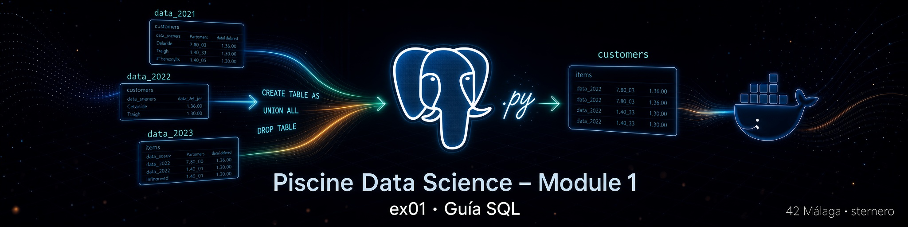

# 📘 Guía SQL – EX01 Customers table

<p align="center">
  
</p>

[← README EX01](./README.md) · [← Module 1](../README.md) · [python.md →](./python.md)

> Si no existe `./imgs/sql_00.jpg` en tu repo, puedes omitir la imagen o usar la de tu carpeta `imgs/`.

---

<a id="indice"></a>
## 📑 Índice

### Parte A – Conceptos SQL necesarios
1. [¿Para quién?](#para-quien)
2. [SQL, tablas y SELECT](#basico)
3. [CREATE TABLE AS SELECT](#ctas)
4. [UNION vs UNION ALL](#union)
5. [DROP TABLE IF EXISTS](#drop)

### Parte B – `customers_table.sql`
6. [Qué pide el subject](#subject)
7. [“Join” aquí = apilar, no JOIN por clave](#join-meaning)
8. [El script completo](#completo)
9. [Por qué no deduplicamos en EX01](#no-dedup)
10. [Ejecutar y comprobar](#ejecutar)
11. [Glosario](#glosario)

---

<a id="para-quien"></a>
## 👋 ¿Para quién?

Para crear la tabla **`customers`** apilando todos los `data_202*` sin asumir conocimientos previos de SQL.

[↑ Volver al índice](#indice)

---

<a id="basico"></a>
## 🗣️ SQL, tablas y SELECT

- **SQL**: idioma para hablar con PostgreSQL.
- **Tabla**: como una hoja de cálculo (ej. `data_2022_oct`).
- **SELECT \* FROM tabla**: “enséñame todas las columnas y filas”.

[↑ Volver al índice](#indice)

---

<a id="ctas"></a>
## 🏗️ CREATE TABLE AS SELECT

```sql
CREATE TABLE customers AS
SELECT * FROM data_2022_oct;
```

Crea `customers` **con el contenido** del `SELECT`. No hace falta listar tipos a mano: se copian del origen.

[↑ Volver al índice](#indice)

---

<a id="union"></a>
## 📚 UNION vs UNION ALL

Imagina dos cajas de tickets del mismo formato.

| Operador | Efecto |
|----------|--------|
| `UNION` | Apila y **elimina filas totalmente duplicadas** |
| `UNION ALL` | Apila **todo**, sin quitar duplicados |

En EX01 usamos **`UNION ALL`**: el subject solo pide juntar los meses. Quitar duplicados es **EX02**.

```sql
SELECT * FROM data_2022_oct
UNION ALL
SELECT * FROM data_2022_nov;
```

Todas las ramas del `UNION ALL` deben tener el **mismo número y tipos compatibles** de columnas (aquí: mismos esquemas de eventos).

[↑ Volver al índice](#indice)

---

<a id="drop"></a>
## 🗑️ DROP TABLE IF EXISTS

```sql
DROP TABLE IF EXISTS customers;
```

Borra `customers` si existía, para poder reejecutar el script limpio.  
`IF EXISTS` evita error la primera vez.

[↑ Volver al índice](#indice)

---

<a id="subject"></a>
## 🎯 Qué pide el subject

> Join all the `data_202*_***` tables together in a table called **`customers`**.  
> Entrega: `customers_table.*`

[↑ Volver al índice](#indice)

---

<a id="join-meaning"></a>
## ⚠️ “Join” aquí = apilar, no JOIN por clave

En inglés del subject, “join … together” significa **reunir / juntar** las tablas mensuales.  
**No** es un `INNER JOIN` entre meses por `user_id`. Los meses se **apilan** verticalmente con `UNION ALL`.

[↑ Volver al índice](#indice)

---

<a id="completo"></a>
## 📜 El script completo (versión SQL fija)

```sql
DROP TABLE IF EXISTS customers;

CREATE TABLE customers AS
SELECT * FROM data_2022_oct
UNION ALL
SELECT * FROM data_2022_nov
UNION ALL
SELECT * FROM data_2022_dec
UNION ALL
SELECT * FROM data_2023_jan
UNION ALL
SELECT * FROM data_2023_feb;
```

- Si te falta `data_2023_feb`, quita esa rama o usa **`customers_table.py`**, que descubre solo las tablas `data_202%` que existan.

[↑ Volver al índice](#indice)

---

<a id="no-dedup"></a>
## 🚫 Por qué no deduplicamos en EX01

El PDF separa:

- EX01 → crear `customers`  
- EX02 → borrar duplicados y ecos a 1 s  

Mezclarlos aquí complica la evaluación y el conteo de control (`COUNT(customers)` = suma de los meses).

[↑ Volver al índice](#indice)

---

<a id="ejecutar"></a>
## ▶️ Ejecutar y comprobar

```bash
docker cp customers_table.sql postgres_piscineds:/tmp/customers_table.sql
docker exec -it postgres_piscineds \
  psql -U "$(whoami)" -d piscineds -W -f /tmp/customers_table.sql
```

```sql
SELECT COUNT(*) FROM customers;
-- ≈ suma de COUNT(*) de cada data_202*
```

[↑ Volver al índice](#indice)

---

<a id="glosario"></a>
## 📖 Glosario

| Término | Significado |
|---------|-------------|
| `UNION ALL` | Apilar resultados sin quitar duplicados |
| `CREATE TABLE AS` | Crear tabla desde una consulta |
| `data_202%` | Patrón de nombres de tablas mensuales |

[↑ Volver al índice](#indice)

---

*Module 1 – EX01 – Guía SQL – sternero – 42 Málaga – 2026*
