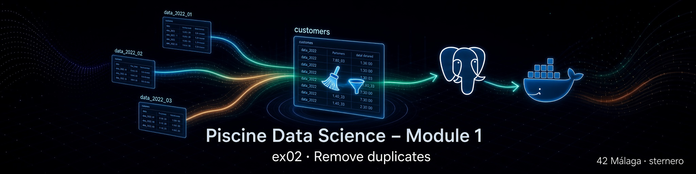

# 🧹 Ejercicio 02 – Remove duplicates

<p align="center">
  
</p>

[← Volver al README principal](../README.md) · [← EX01](../ex01/README.md) · [EX03 →](../ex03/README.md)

---

<a id="indice"></a>
## 📑 Índice

1. [¿Qué se pide?](#que-se-pide)
2. [Archivos a entregar](#archivos)
3. [Explicación sencilla](#explicacion)
4. [Regla de negocio (subject)](#regla)
5. [Cómo funciona la solución](#solucion)
6. [Ejecutar (paso a paso)](#ejecutar)
7. [Asistente `start.sh`](#startsh)
8. [Comprobar el resultado](#comprobar)
9. [Guías didácticas](#guias)
10. [Errores frecuentes](#errores)
11. [Checklist](#checklist)
12. [Navegación](#navegacion)

---

<a id="que-se-pide"></a>
## 🎯 ¿Qué se pide?

Según el **subject** (Module 1 – Data Warehouse – EX02):

> Delete the duplicate rows in the **`customers`** table.  
> Sometimes the server logs the **same instruction** twice with a **1 second** interval — remove those too.

| Requisito | Detalle |
|-----------|---------|
| Tabla | `customers` (creada en EX01) |
| Acción | Eliminar duplicados **y** casi-duplicados a 1 s |
| Entrega | `ex02/remove_duplicates.*` (`.sql`, `.py`, …) |

Ejemplo:

```text
2022-10-01 00:00:32  remove_from_cart  product 5779403
2022-10-01 00:00:33  remove_from_cart  product 5779403
→ debe quedar solo UNA de las dos filas
```

[↑ Volver al índice](#indice)

---

<a id="archivos"></a>
## 📁 Archivos a entregar

| Archivo | Rol |
|---------|-----|
| [`remove_duplicates.sql`](./remove_duplicates.sql) | Script SQL puro (válido como entrega) |
| [`remove_duplicates.py`](./remove_duplicates.py) | Misma lógica vía Python + `psycopg2` |

Ayuda (no sustituyen la entrega):

| Archivo | Rol |
|---------|-----|
| [`start.sh`](./start.sh) | Menú: comprobar, ejecutar, COUNT, psql |
| [`sql.md`](./sql.md) | Guía didáctica del SQL |
| [`python.md`](./python.md) | Guía didáctica del script Python |

[↑ Volver al índice](#indice)

---

<a id="explicacion"></a>
## 🧠 Explicación sencilla

En EX01 apilamos todos los meses en **`customers`** con `UNION ALL` (sin quitar nada).

Ahora el almacén tiene filas de más:

1. **Duplicados exactos** — la misma fila repetida.  
2. **Ecos a 1 segundo** — el servidor registró dos veces la misma acción casi al mismo tiempo.

EX02 **limpia** la tabla para que el Data Warehouse no cuente dos veces la misma instrucción.

[↑ Volver al índice](#indice)

---

<a id="regla"></a>
## 📐 Regla de negocio que implementamos

Consideramos la **misma instrucción** cuando coinciden:

| Campo | Por qué |
|-------|---------|
| `user_id` | Mismo cliente |
| `user_session` | Misma sesión de navegación |
| `event_type` | Misma acción (`view`, `cart`, `remove_from_cart`, …) |
| `product_id` | Mismo producto (como en el ejemplo del subject) |
| `price` | Mismo precio en ese momento |

Si, además, el `event_time` de la fila **siguiente** (ordenada en el tiempo) está a **0 o ≤ 1 segundo** de la anterior → **borramos la posterior** y conservamos la primera.

Eso cubre:

- timestamps **iguales** (duplicado exacto), y  
- el caso del subject (**1 segundo** de diferencia).

[↑ Volver al índice](#indice)

---

<a id="solucion"></a>
## ⚙️ Cómo funciona la solución

Usamos una **función de ventana** `LAG`:

1. Agrupar (`PARTITION BY`) por las claves de negocio.  
2. Ordenar por `event_time` (y `ctid` para desempate estable).  
3. `LAG(event_time)` = tiempo de la fila anterior del mismo grupo.  
4. Si `event_time - prev_time ≤ 1 second` → esa fila es un eco → `DELETE`.

`ctid` es el identificador físico interno de PostgreSQL; solo sirve para señalar qué fila borrar, no forma parte del modelo de negocio.

Detalle línea a línea:

- SQL → **[sql.md](./sql.md)**  
- Python → **[python.md](./python.md)**

[↑ Volver al índice](#indice)

---

<a id="ejecutar"></a>
## ▶️ Ejecutar (paso a paso)

### Requisitos previos

1. Contenedor `postgres_piscineds` **Up** (Module 0).  
2. Tabla **`customers`** ya creada (EX01) con datos.

```bash
docker ps | grep postgres_piscineds
```

### Opción A – Python (recomendada para ver before/after)

```bash
cd ruta/a/data_science_1_data_warehouse/ex02
python3 remove_duplicates.py
```

### Opción B – SQL

```bash
docker cp remove_duplicates.sql postgres_piscineds:/tmp/remove_duplicates.sql

docker exec -it postgres_piscineds \
  psql -U "$(whoami)" -d piscineds -W -f /tmp/remove_duplicates.sql
```

### Opción C – Asistente

```bash
chmod +x start.sh
./start.sh
```

> ⏱️ Sobre **~20 millones** de filas la operación puede tardar **varios minutos**. Es normal.

[↑ Volver al índice](#indice)

---

<a id="startsh"></a>
## 🎛️ Asistente `start.sh`

Script **opcional** (no sustituye `remove_duplicates.*`).

| Opción | Acción |
|--------|--------|
| 1 | Arrancar contenedor + pgAdmin (si hace falta) |
| 2 | Comprobar contenedor |
| 3 | `COUNT(*)` de `customers` |
| 4 | Ejecutar `remove_duplicates.py` |
| 5 | Aplicar `remove_duplicates.sql` |
| 6 | Verificar COUNT de nuevo |
| 7 | Abrir `psql` |
| **q** | Salir |

Llamable desde cualquier directorio:

```bash
/ruta/completa/a/ex02/start.sh
```

[↑ Volver al índice](#indice)

---

<a id="comprobar"></a>
## ✅ Comprobar el resultado

```bash
docker exec -it postgres_piscineds \
  psql -U "$(whoami)" -d piscineds -W
```

```sql
SELECT COUNT(*) FROM customers;
```

Esperado:

- El número es **menor** (o igual si no había ecos) que el de EX01 (~20.692.840 en un dataset típico).  
- La tabla sigue llamándose **`customers`**.  
- Las columnas no cambian.

Muestra:

```sql
SELECT * FROM customers ORDER BY event_time LIMIT 5;
```

```sql
\q
```

[↑ Volver al índice](#indice)

---

<a id="guias"></a>
## 📘 Guías didácticas

| Guía | Contenido |
|------|-----------|
| **[sql.md](./sql.md)** | `DELETE`, `LAG`, `PARTITION BY`, `ctid`, intervalo de 1 s |
| **[python.md](./python.md)** | Conexión, ejecución del SQL, conteos before/after |

[↑ Volver al índice](#indice)

---

<a id="errores"></a>
## 🛠️ Errores frecuentes

| Síntoma | Qué hacer |
|---------|-----------|
| `relation "customers" does not exist` | Ejecuta antes EX01 (`customers_table.*`) |
| `connection refused` | `docker-compose up -d` en Module 0 `ex00/` |
| Tarda mucho / parece colgado | Normal en ~20 M filas; espera o mira `docker logs` |
| `permission denied` / auth failed | Revisa `ex00/.env` del Module 0 |
| SQL aplicado dos veces | Seguro: la segunda vez borrará 0 filas si ya estaba limpio |

[↑ Volver al índice](#indice)

---

<a id="checklist"></a>
## ✅ Checklist

| Requisito | ☐ |
|-----------|---|
| Existe `ex02/remove_duplicates.*` | ☐ |
| Se eliminan duplicados en `customers` | ☐ |
| Se contemplan pares a **1 segundo** (subject) | ☐ |
| `COUNT(*)` tras la limpieza es coherente | ☐ |
| No se exige hardcodear meses ni nombres de CSV | ☐ |

[↑ Volver al índice](#indice)

---

<a id="navegacion"></a>
## 🔗 Navegación

- [← README Module 1](../README.md)
- [← EX01 – customers](../ex01/README.md)
- [📘 sql.md](./sql.md)
- [🐍 python.md](./python.md)
- [EX03 – fusion →](../ex03/README.md)

---

*Piscine Data Science – Module 1 – EX02 – sternero – 42 Málaga – Octubre 2026*
