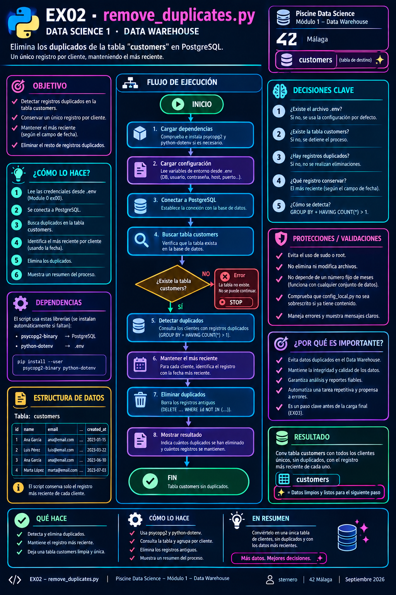

# 🐍 Guía Python – EX02 Remove duplicates

<p align="center">
  
</p>

[← README EX02](./README.md) · [← sql.md](./sql.md) · [← Module 1](../README.md)

---

<a id="indice"></a>
## 📑 Índice

### Parte A – Python básico para este script
1. [¿Para quién es esta guía?](#para-quien)
2. [Script, variables, funciones, import](#basico)
3. [`try` / `with` / f-strings](#try-with)
4. [¿Por qué el trabajo pesado va en SQL?](#por-que-sql)

### Parte B – `remove_duplicates.py`
5. [Objetivo del subject](#subject)
6. [Diagrama de flujo](#diagrama)
7. [Estructura del archivo](#estructura)
8. [Dependencias y `.env`](#deps)
9. [La cadena `DELETE_SQL`](#delete-sql)
10. [`main()`: before → DELETE → after](#main)
11. [Cómo ejecutarlo](#ejecutar)
12. [Errores habituales](#errores)
13. [Glosario](#glosario)

---

<a id="para-quien"></a>
## 👋 ¿Para quién es esta guía?

Para ejecutar y entender `remove_duplicates.py` sin ser experto en Python.  
La regla del subject (duplicados + 1 segundo) está explicada en detalle en [sql.md](./sql.md).

[↑ Volver al índice](#indice)

---

<a id="basico"></a>
## 🧱 Script, variables, funciones, import

- **Script**: archivo `.py` con pasos en orden.
- **Variable**: caja con nombre (`before = 20692840`).
- **Función** (`def`): bloque reutilizable.
- **`import`**: trae módulos (`psycopg2`, `Path`, …).

```bash
python3 remove_duplicates.py
```

[↑ Volver al índice](#indice)

---

<a id="try-with"></a>
## 🛡️ `try` / `with` / f-strings

```python
try:
    with get_connection() as conn:
        with conn.cursor() as cur:
            ...
except psycopg2.Error as exc:
    print("Error:", exc)
```

- `with` cierra conexión/cursor al salir.
- `try`/`except` muestra errores de PostgreSQL sin trazar un fallo críptico.
- `f"... {variable}"` inserta valores en el texto.

[↑ Volver al índice](#indice)

---

<a id="por-que-sql"></a>
## ⚙️ ¿Por qué el trabajo pesado va en SQL?

Borrar ~1,5 M de filas entre 20 M **en un bucle Python** sería lentísimo.  
El script envía **un solo DELETE** al servidor; PostgreSQL usa la ventana `LAG` de forma optimizada.

[↑ Volver al índice](#indice)

---

<a id="subject"></a>
## 🎯 Objetivo del subject

Eliminar en **`customers`**:

1. filas duplicadas;
2. la misma instrucción repetida con **≤ 1 segundo** de diferencia.

[↑ Volver al índice](#indice)

---

<a id="diagrama"></a>
## 🗺️ Diagrama de flujo

<p align="center">
  
</p>

```text
Inicio → deps → .env → conectar
  → COUNT antes → DELETE (LAG) → COUNT después → fin
```

[↑ Volver al índice](#indice)

---

<a id="estructura"></a>
## 🧱 Estructura del archivo

| Bloque | Rol |
|--------|-----|
| Docstring | Subject, pasos, analogía, uso |
| `ensure_dependencies` | pip --user si falta psycopg2/dotenv |
| `find_env_file` | Localizar Module 0 `.env` |
| `DB_CONFIG` | Conexión localhost:5432 |
| `DELETE_SQL` | Misma lógica que el `.sql` |
| `count_customers` | `SELECT COUNT(*)` |
| `main` | Orquestación y mensajes |

[↑ Volver al índice](#indice)

---

<a id="deps"></a>
## 📦 Dependencias y `.env`

- **psycopg2**: hablar con PostgreSQL  
- **python-dotenv**: leer `POSTGRES_*` sin hardcodear secretos  

Si no hay `.env`, se usan valores por defecto del subject (`piscineds`, `mysecretpassword`, usuario del sistema).

[↑ Volver al índice](#indice)

---

<a id="delete-sql"></a>
## 📜 La cadena `DELETE_SQL`

String con el `DELETE ... LAG ... INTERVAL '1 second'` descrito en [sql.md](./sql.md).  
`cur.execute(DELETE_SQL)` lo envía al servidor de una vez.

[↑ Volver al índice](#indice)

---

<a id="main"></a>
## 🎬 `main()`: before → DELETE → after

1. Mostrar regla y ruta `.env`.  
2. `COUNT(*)` **antes**.  
3. Ejecutar DELETE (puede tardar minutos).  
4. `COUNT(*)` **después**.  
5. `commit()` para persistir.  
6. Mostrar filas eliminadas.

Ejemplo real de campus:

```text
COUNT(*) antes:  20692840
COUNT(*) después: 19175899
Filas borradas: 1516941
```

[↑ Volver al índice](#indice)

---

<a id="ejecutar"></a>
## ▶️ Cómo ejecutarlo

```bash
cd ruta/a/ex02
python3 remove_duplicates.py
# o
./start.sh   # opción ejecutar .py
```

[↑ Volver al índice](#indice)

---

<a id="errores"></a>
## 🛠️ Errores habituales

| Síntoma | Qué hacer |
|---------|-----------|
| No existe `customers` | EX01 primero |
| `connection refused` | Docker Module 0 |
| `ModuleNotFoundError` | `pip install --user psycopg2-binary python-dotenv` |

[↑ Volver al índice](#indice)

---

<a id="glosario"></a>
## 📖 Glosario

| Término | Significado |
|---------|-------------|
| Driver | Librería de conexión a la BD |
| `commit` | Confirmar cambios |
| `rowcount` | Filas afectadas (si el driver lo informa) |
| f-string | Texto con `{variables}` |

[↑ Volver al índice](#indice)

---

*Module 1 – EX02 – Guía Python – sternero – 42 Málaga – 2026*
