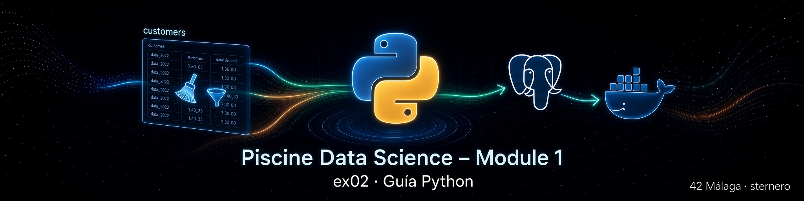

# 🐍 Guía Python – EX02 Remove duplicates

<p align="center">
  
</p>

[← README EX02](./README.md) · [← sql.md](./sql.md) · [← Module 1](../README.md)

---

<a id="indice"></a>
## 📑 Índice

1. [Para quién es esta guía](#para-quien)
2. [Qué hace el script](#que-hace)
3. [Estructura del archivo](#estructura)
4. [Dependencias y `.env`](#deps)
5. [La consulta DELETE en Python](#delete)
6. [Conteos before / after](#conteos)
7. [Cómo ejecutarlo](#ejecutar)
8. [Errores habituales](#errores)
9. [Relación con el `.sql`](#sql)
10. [Glosario](#glosario)

---

<a id="para-quien"></a>
## 👋 Para quién es esta guía

Para quien prefiere lanzar la limpieza de `customers` con:

```bash
python3 remove_duplicates.py
```

y quiere entender el código **sin** asumir experiencia previa en Python.

La lógica de negocio es la misma que en [`remove_duplicates.sql`](./remove_duplicates.sql); Python solo **conecta**, **ejecuta** y **muestra** los conteos.

[↑ Volver al índice](#indice)

---

<a id="que-hace"></a>
## 🎯 Qué hace el script

```text
1. (Si hace falta) instalar psycopg2 y python-dotenv
2. Leer usuario / contraseña / BD desde Module 0 ex00/.env
3. Conectar a localhost:5432 → piscineds
4. COUNT(*)  →  "before"
5. Ejecutar el DELETE con LAG (≤ 1 segundo)
6. COUNT(*)  →  "after"
7. Mostrar cuántas filas se fueron
```

Analogía: el script es el **mando a distancia**; el trabajo pesado lo hace PostgreSQL dentro del contenedor.

[↑ Volver al índice](#indice)

---

<a id="estructura"></a>
## 🧱 Estructura del archivo

| Bloque | Rol |
|--------|-----|
| Cabecera / docstring | Objetivo del subject y uso |
| `ensure_dependencies()` | `pip install --user` si faltan librerías |
| Rutas + `find_env_file()` | Encontrar `.env` sin path de un solo login |
| `DB_CONFIG` | host, port, dbname, user, password |
| `DELETE_SQL` | Misma sentencia que el `.sql` |
| `get_connection()` | `psycopg2.connect` |
| `count_customers()` | `SELECT COUNT(*)` |
| `main()` | Orquesta before → DELETE → after |

[↑ Volver al índice](#indice)

---

<a id="deps"></a>
## 📦 Dependencias y `.env`

```python
# Ideas clave
psycopg2   → driver para hablar con PostgreSQL
dotenv     → cargar POSTGRES_* desde un archivo .env
```

El script busca, entre otras:

```text
../data_science_0_creation_db/ex00/.env
```

Si no hay `.env`, usa variables de entorno o valores por defecto del subject (`piscineds`, `mysecretpassword`, usuario del sistema).

[↑ Volver al índice](#indice)

---

<a id="delete"></a>
## 🗑️ La consulta DELETE en Python

No reescribimos la lógica en bucles Python (sería lentísimo con 20 M filas).

Enviamos **un solo SQL** al servidor:

```python
cur.execute(DELETE_SQL)
```

Ese texto es el mismo `DELETE ... LAG ... INTERVAL '1 second'` explicado en [sql.md](./sql.md).

Ventaja: un solo sitio mental para la regla del subject; el `.py` aporta comodidad y conteos.

[↑ Volver al índice](#indice)

---

<a id="conteos"></a>
## 🔢 Conteos before / after

```python
before = count_customers(cur)
cur.execute(DELETE_SQL)
after = count_customers(cur)
conn.commit()
```

- **`commit()`** confirma los borrados de forma definitiva.  
- Sin `commit`, en muchos modos los cambios no quedan guardados.

En pantalla verás algo similar a:

```text
COUNT(*) before: 20692840
COUNT(*) after:  19xxxxxx
```

[↑ Volver al índice](#indice)

---

<a id="ejecutar"></a>
## ▶️ Cómo ejecutarlo

```bash
cd ruta/a/data_science_1_data_warehouse/ex02

# Contenedor arriba
docker ps | grep postgres_piscineds

python3 remove_duplicates.py
# o
chmod +x remove_duplicates.py
./remove_duplicates.py
```

También desde [`start.sh`](./start.sh) → opción **Ejecutar remove_duplicates.py**.

[↑ Volver al índice](#indice)

---

<a id="errores"></a>
## 🛠️ Errores habituales

| Mensaje / síntoma | Causa probable | Qué hacer |
|-------------------|----------------|-----------|
| `ModuleNotFoundError: psycopg2` | Paquete no instalado | El script intenta instalar; o `pip install --user psycopg2-binary` |
| `connection refused` | Docker parado | `docker-compose up -d` en Module 0 |
| `relation "customers" does not exist` | Falta EX01 | Crear `customers` antes |
| Pylance “import could not be resolved” | Aviso del editor | No impide ejecutar en terminal si el paquete está instalado |
| Muy lento | Tabla enorme | Esperar; es trabajo en el servidor SQL |

[↑ Volver al índice](#indice)

---

<a id="sql"></a>
## 🔗 Relación con el `.sql`

| Entrega | Cuándo usarla |
|---------|----------------|
| `remove_duplicates.sql` | Evaluación clásica con `psql -f` |
| `remove_duplicates.py` | Misma regla + mensajes before/after |

Ambas son válidas como `remove_duplicates.*` según el subject.

[↑ Volver al índice](#indice)

---

<a id="glosario"></a>
## 📖 Glosario

| Término | Significado |
|---------|-------------|
| `psycopg2` | Librería Python ↔ PostgreSQL |
| `cursor` | Canal para enviar SQL y leer resultados |
| `commit` | Confirmar la transacción |
| `rowcount` | Filas afectadas por el último comando (si el driver lo informa) |

[↑ Volver al índice](#indice)

---

*Module 1 – EX02 – Guía Python – sternero – 42 Málaga – Octubre 2026*
