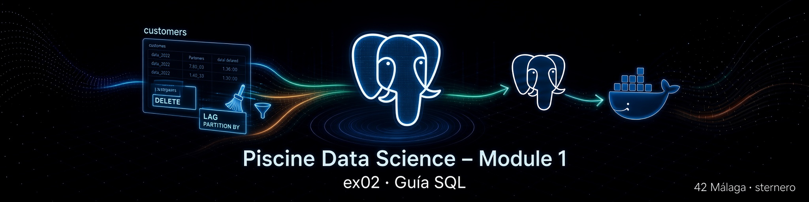

# 📘 Guía SQL – EX02 Remove duplicates

<p align="center">
  
</p>

[← README EX02](./README.md) · [← Module 1](../README.md) · [python.md →](./python.md)

---

<a id="indice"></a>
## 📑 Índice

### Parte A – SQL básico aplicado a este ejercicio
1. [¿Para quién es esta guía?](#para-quien)
2. [Qué es SQL (recordatorio breve)](#sql)
3. [DELETE: borrar filas (no la tabla)](#delete)
4. [WHERE: “solo estas filas”](#where)
5. [Funciones de ventana (idea)](#ventana)
6. [PARTITION BY y ORDER BY](#partition)
7. [LAG: mirar la fila de arriba](#lag)
8. [INTERVAL: hablar de tiempo](#interval)
9. [ctid: el “número de estantería” interno](#ctid)

### Parte B – El subject y `remove_duplicates.sql`
10. [Qué pide el subject](#subject)
11. [Duplicado exacto vs eco a 1 segundo](#dup)
12. [Claves de negocio de una “instrucción”](#claves)
13. [El DELETE completo, frase a frase](#completo)
14. [Por qué no basta DISTINCT](#distinct)
15. [Cómo ejecutarlo](#ejecutar)
16. [Comprobar](#comprobar)
17. [Errores frecuentes](#errores)
18. [Glosario](#glosario)

---

<a id="para-quien"></a>
## 👋 ¿Para quién es esta guía?

Para quien debe limpiar **`customers`** (EX02) y aún no domina ventanas SQL (`LAG`, `PARTITION BY`).  
Partimos de cero en los conceptos que usa el script y luego lo leemos línea a línea.

[↑ Volver al índice](#indice)

---

<a id="sql"></a>
## 🗣️ Qué es SQL (recordatorio breve)

SQL es el idioma del archivero (PostgreSQL).  
Pedimos datos (`SELECT`), creamos estructuras (`CREATE`), borramos filas (`DELETE`), etc.

[↑ Volver al índice](#indice)

---

<a id="delete"></a>
## 🗑️ DELETE: borrar filas (no la tabla)

```sql
DELETE FROM customers
WHERE ...condicion...;
```

Analogía: quitas **carteles repetidos** del tablón; el tablón (`customers`) sigue existiendo.

- `DELETE` ≠ `DROP TABLE` (DROP tira tablón y carteles).
- Sin `WHERE`, borrarías **todas** las filas (aquí no lo hacemos).

[↑ Volver al índice](#indice)

---

<a id="where"></a>
## 🎯 WHERE: “solo estas filas”

Filtra qué filas se ven o se borran.

```sql
WHERE prev_time IS NOT NULL
  AND event_time - prev_time <= INTERVAL '1 second'
```

Solo las filas que cumplen **las dos** condiciones.

[↑ Volver al índice](#indice)

---

<a id="ventana"></a>
## 🪟 Funciones de ventana (idea)

Una función de ventana calcula algo **mirando un grupo de filas relacionadas**, sin colapsar el resultado en una sola fila por grupo (eso sería `GROUP BY`).

Analogía: en una cola del supermercado, cada persona puede preguntar “¿a qué hora llegó el de delante?” sin que la cola deje de ser una lista de personas.

[↑ Volver al índice](#indice)

---

<a id="partition"></a>
## 📚 PARTITION BY y ORDER BY

```sql
OVER (
  PARTITION BY user_id, user_session, event_type, product_id, price
  ORDER BY event_time, ctid
)
```

- **PARTITION BY**: “dentro de cada grupo de misma instrucción de negocio…”
- **ORDER BY**: “…ordenados en el tiempo (y ctid si empatan)”

Cada partición es como una **cinta temporal** de un mismo usuario/sesión/acción/producto/precio.

[↑ Volver al índice](#indice)

---

<a id="lag"></a>
## ⬅️ LAG: mirar la fila de arriba

```sql
LAG(event_time) OVER (...) AS prev_time
```

Devuelve el `event_time` de la **fila anterior** en la misma partición.

- La **primera** fila del grupo no tiene anterior → `prev_time` es NULL → **no se borra**.
- Si la actual llegó 0 s o ≤ 1 s después de la anterior → es un eco → **candidata a borrado**.

[↑ Volver al índice](#indice)

---

<a id="interval"></a>
## ⏱️ INTERVAL: hablar de tiempo

```sql
INTERVAL '1 second'
```

Es la forma SQL de decir “una duración de un segundo”.  
Restar dos timestamps da un intervalo; lo comparamos con ese límite del subject.

[↑ Volver al índice](#indice)

---

<a id="ctid"></a>
## 🏷️ ctid: el “número de estantería” interno

`ctid` identifica físicamente una versión de fila dentro de PostgreSQL.

- No es columna de negocio (no lo uses en el modelo final).
- Sirve para decir: “borra **esta** fila concreta”.
- En el `ORDER BY` desempata cuando dos eventos tienen el mismo `event_time`.

[↑ Volver al índice](#indice)

---

<a id="subject"></a>
## 🎯 Qué pide el subject

> Delete the duplicate rows in the "customers" table.  
> Sometimes the server sends the same instruction with **1 second** interval, so you must also remove them.

Ejemplo del PDF:

```text
2022-10-01 00:00:32  remove_from_cart  5779403
2022-10-01 00:00:33  remove_from_cart  5779403
→ una sola fila final
```

[↑ Volver al índice](#indice)

---

<a id="dup"></a>
## 🔁 Duplicado exacto vs eco a 1 segundo

| Tipo | Tiempo | Tratamiento con LAG ≤ 1 s |
|------|--------|---------------------------|
| Exacto | Igual (0 s) | Se borra la posterior |
| Eco (subject) | 1 segundo después | Se borra la posterior |

Una sola regla cubre ambos.

[↑ Volver al índice](#indice)

---

<a id="claves"></a>
## 🔑 Claves de negocio de una “instrucción”

Consideramos la misma instrucción cuando coinciden:

| Campo | Por qué |
|-------|---------|
| `user_id` | Mismo cliente |
| `user_session` | Misma visita |
| `event_type` | Misma acción |
| `product_id` | Mismo producto (como en el ejemplo) |
| `price` | Mismo precio en ese contexto |

[↑ Volver al índice](#indice)

---

<a id="completo"></a>
## 📜 El DELETE completo, frase a frase

```sql
DELETE FROM customers AS c
USING (
    SELECT s.ctid AS rid
    FROM (
        SELECT
            ctid,
            event_time,
            LAG(event_time) OVER (
                PARTITION BY
                    user_id, user_session, event_type, product_id, price
                ORDER BY event_time, ctid
            ) AS prev_time
        FROM customers
    ) AS s
    WHERE s.prev_time IS NOT NULL
      AND s.event_time - s.prev_time <= INTERVAL '1 second'
) AS d
WHERE c.ctid = d.rid;
```

| Parte | Significado |
|-------|-------------|
| Subconsulta interna | Calcula `prev_time` por fila |
| `WHERE ... <= 1 second` | Marca ecos |
| `DELETE ... USING` | Borra de `customers` los `ctid` marcados |
| Primera de cada grupo | `prev_time` NULL → se conserva |

[↑ Volver al índice](#indice)

---

<a id="distinct"></a>
## ❓ Por qué no basta DISTINCT

`DISTINCT *` solo quita filas **idénticas en todas las columnas**.  
El caso del subject tiene **timestamps distintos** (32 vs 33 s) → hace falta la lógica temporal con `LAG`.

[↑ Volver al índice](#indice)

---

<a id="ejecutar"></a>
## ▶️ Cómo ejecutarlo

```bash
docker cp remove_duplicates.sql postgres_piscineds:/tmp/remove_duplicates.sql
docker exec -it postgres_piscineds \
  psql -U "$(whoami)" -d piscineds -W -f /tmp/remove_duplicates.sql
```

O `python3 remove_duplicates.py` / [`start.sh`](./start.sh).

[↑ Volver al índice](#indice)

---

<a id="comprobar"></a>
## ✅ Comprobar

```sql
SELECT COUNT(*) FROM customers;
```

Debe ser **menor** (o igual si no había ecos) que el COUNT tras EX01.  
En un dataset típico del campus: de ~20,6 M a ~19,2 M.

[↑ Volver al índice](#indice)

---

<a id="errores"></a>
## 🛠️ Errores frecuentes

| Síntoma | Qué hacer |
|---------|-----------|
| No existe `customers` | Ejecutar EX01 antes |
| Tarda mucho | Normal con ~20 M filas |
| Segunda ejecución borra 0 | Ya estaba limpio; es seguro |

[↑ Volver al índice](#indice)

---

<a id="glosario"></a>
## 📖 Glosario

| Término | Significado |
|---------|-------------|
| `DELETE` | Borrar filas |
| Ventana / `OVER` | Cálculo sobre un conjunto de filas |
| `PARTITION BY` | Grupos de la ventana |
| `LAG` | Valor de la fila anterior |
| `INTERVAL` | Duración de tiempo |
| `ctid` | Id físico interno de fila |

[↑ Volver al índice](#indice)

---

*Module 1 – EX02 – Guía SQL – sternero – 42 Málaga – 2026*
