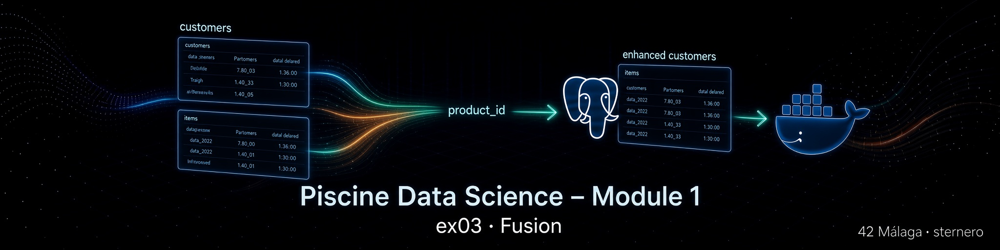
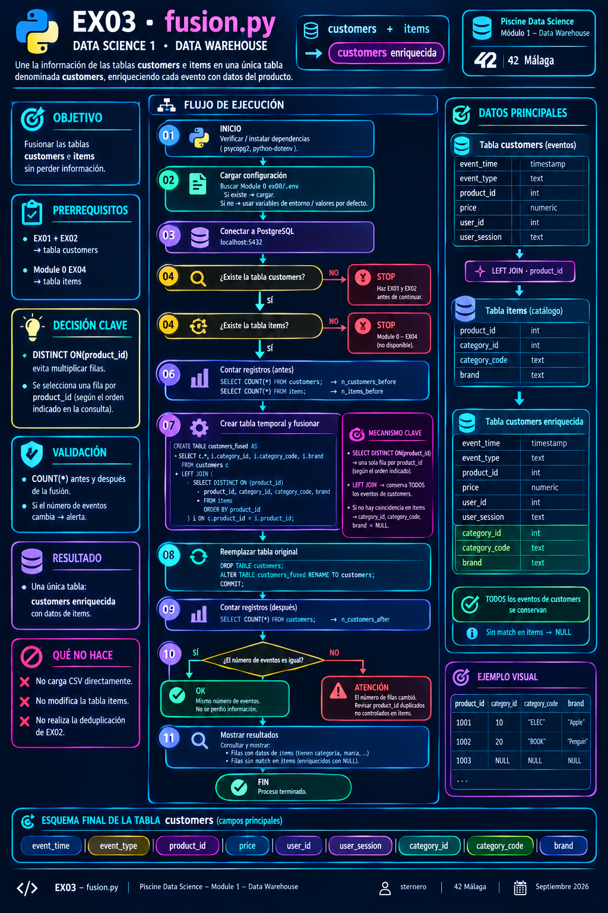

# 🔗 Ejercicio 03 – Fusion

<p align="center">
  
</p>

[← Volver al README principal](../README.md) · [← EX02](../ex02/README.md)

---

<a id="indice"></a>
## 📑 Índice

1. [¿Qué se pide?](#que-se-pide)
2. [Archivos a entregar](#archivos)
3. [Explicación sencilla](#explicacion)
4. [Por qué LEFT JOIN](#left-join)
5. [Cómo funciona la solución](#solucion)
6. [Ejecutar (paso a paso)](#ejecutar)
7. [Asistente start.sh](#startsh)
8. [Comprobar el resultado](#comprobar)
9. [Guías didácticas](#guias)
10. [Errores frecuentes](#errores)
11. [Checklist](#checklist)
12. [Navegación](#navegacion)

---

<a id="que-se-pide"></a>
## 🎯 ¿Qué se pide?

Según el **subject** (Module 1 – Data Warehouse – EX03):

> Fusion the **customers** table and the **items** table together.  
> They must be fused in such a way that **no information is lost**.

| Requisito | Detalle |
|-----------|---------|
| Tablas | `customers` (EX01–EX02) + `items` (Module 0 EX04) |
| Resultado | Información de items incorporada a **customers** |
| Sin perder info | Todos los eventos de customers deben seguir existiendo |
| Entrega | `ex03/fusion.*` (`.sql`, `.py`, …) |

[↑ Volver al índice](#indice)

---

<a id="archivos"></a>
## 📁 Archivos a entregar

| Archivo | Rol |
|---------|-----|
| [`fusion.sql`](./fusion.sql) | Script SQL puro (válido como entrega) |
| [`fusion.py`](./fusion.py) | Misma lógica vía Python + mensajes de control |

Ayuda (no sustituyen la entrega):

| Archivo | Rol |
|---------|-----|
| [`start.sh`](./start.sh) | Menú: entorno, ejecutar, COUNT, psql |
| [`sql.md`](./sql.md) | Guía didáctica del SQL |
| [`python.md`](./python.md) | Guía didáctica del Python |

[↑ Volver al índice](#indice)

---

<a id="explicacion"></a>
## 🧠 Explicación sencilla

- **customers** = historial de acciones (ver, carrito, quitar del carrito…).  
- **items** = catálogo (categoría, marca…).  

La fusión **pega la ficha del producto** en cada acción, usando `product_id` como puente.

Si un producto del historial **no** está en el catálogo, **no tiramos** esa acción: dejamos categoría/marca a NULL. Así no se pierde información.

<p align="center">
  
</p>

[↑ Volver al índice](#indice)

---

<a id="left-join"></a>
## 📐 Por qué LEFT JOIN (y no INNER JOIN)

| Tipo de JOIN | Efecto |
|--------------|--------|
| **INNER JOIN** | Solo filas con match en **ambas** tablas → se pierden eventos sin producto en items |
| **LEFT JOIN** (customers a la izquierda) | **Todas** las filas de customers + datos de items si existen |

El subject dice *“no information is lost”* → **LEFT JOIN** desde `customers`.

Además, si `items` tuviera varias filas por el mismo `product_id`, un JOIN directo **multiplicaría** eventos. Por eso usamos `DISTINCT ON (product_id)` al lado de items (una ficha por producto).

[↑ Volver al índice](#indice)

---

<a id="solucion"></a>
## ⚙️ Cómo funciona la solución

1. `CREATE TABLE customers_fused AS`  
   `SELECT` columnas de customers + `category_id`, `category_code`, `brand`  
   `FROM customers LEFT JOIN (items deduplicado por product_id)`.  
2. `DROP TABLE customers`.  
3. `ALTER TABLE customers_fused RENAME TO customers`.

La tabla final se sigue llamando **`customers`** (con columnas nuevas).

Detalle:

- SQL → **[sql.md](./sql.md)**  
- Python → **[python.md](./python.md)**

[↑ Volver al índice](#indice)

---

<a id="ejecutar"></a>
## ▶️ Ejecutar (paso a paso)

### Requisitos previos

1. Contenedor `postgres_piscineds` **Up**.  
2. Tabla **`customers`** (EX01 + EX02).  
3. Tabla **`items`** (Module 0 – EX04).

```bash
docker ps | grep postgres_piscineds
```

### Opción A – Python (recomendada)

```bash
cd ruta/a/data_science_1_data_warehouse/ex03
python3 fusion.py
```

### Opción B – SQL

```bash
docker cp fusion.sql postgres_piscineds:/tmp/fusion.sql

docker exec -it postgres_piscineds \
  psql -U "$(whoami)" -d piscineds -W -f /tmp/fusion.sql
```

### Opción C – Asistente

```bash
chmod +x start.sh
./start.sh
```

> ⏱️ Puede tardar **varios minutos** con ~19 M de filas.

[↑ Volver al índice](#indice)

---

<a id="startsh"></a>
## 🎛️ Asistente `start.sh`

| Opción | Acción |
|--------|--------|
| 1 | Arrancar contenedor + pgAdmin |
| 2 | Comprobar contenedor |
| 3 | `COUNT(*)` de `customers` e `items` |
| 4 | Ejecutar `fusion.py` |
| 5 | Aplicar `fusion.sql` |
| 6 | Ver columnas de `customers` (`\d`) |
| 7 | Abrir `psql` |
| 8 | Rutas de guías |
| **q** | Salir |

[↑ Volver al índice](#indice)

---

<a id="comprobar"></a>
## ✅ Comprobar el resultado

```bash
docker exec -it postgres_piscineds \
  psql -U "$(whoami)" -d piscineds -W
```

```sql
\d customers
```

Debes ver, además de las columnas originales:

```text
 category_id | bigint
 category_code | character varying
 brand | character varying
```

```sql
SELECT COUNT(*) FROM customers;
-- Debe ser igual al COUNT de customers JUSTO antes de fusionar
-- (tras EX02: ~19175899 en el dataset típico del campus)
```

```sql
SELECT * FROM customers WHERE brand IS NOT NULL LIMIT 5;
SELECT COUNT(*) FILTER (WHERE category_id IS NULL) AS sin_match FROM customers;
```

```sql
\q
```

[↑ Volver al índice](#indice)

---

<a id="guias"></a>
## 📘 Guías didácticas

| Guía | Contenido |
|------|-----------|
| **[sql.md](./sql.md)** | LEFT JOIN, DISTINCT ON, renombrado de tablas |
| **[python.md](./python.md)** | Conexión, ejecución, comprobaciones before/after |

[↑ Volver al índice](#indice)

---

<a id="errores"></a>
## 🛠️ Errores frecuentes

| Síntoma | Qué hacer |
|---------|-----------|
| `relation "customers" does not exist` | Completa EX01 (y EX02 si aplica) |
| `relation "items" does not exist` | Module 0 EX04 – tabla `items` |
| `COUNT` de customers **sube** mucho | Revisa duplicados en `items.product_id` (el script usa DISTINCT ON) |
| `COUNT` de customers **baja** | No uses INNER JOIN; este material usa LEFT JOIN |
| Auth / connection refused | `.env` de Module 0 y `docker ps` |

[↑ Volver al índice](#indice)

---

<a id="checklist"></a>
## ✅ Checklist

| Requisito | ☐ |
|-----------|---|
| Existe `ex03/fusion.*` | ☐ |
| `customers` tiene datos de `items` (columnas nuevas) | ☐ |
| No se pierden filas de eventos (LEFT JOIN) | ☐ |
| `COUNT(*)` de customers estable respecto a pre-fusión | ☐ |
| Tabla final sigue llamándose `customers` | ☐ |

[↑ Volver al índice](#indice)

---

<a id="navegacion"></a>
## 🔗 Navegación

- [← README Module 1](../README.md)
- [← EX02 – remove duplicates](../ex02/README.md)
- [📘 sql.md](./sql.md)
- [🐍 python.md](./python.md)
- [🎛️ start.sh](./start.sh)

---

*Piscine Data Science – Module 1 – EX03 – sternero – 42 Málaga – Octubre 2026*
