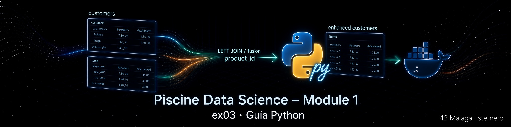

# 🐍 Guía Python – EX03 Fusion

<p align="center">
  
</p>

[← README EX03](./README.md) · [← sql.md](./sql.md) · [← Module 1](../README.md)

---

<a id="indice"></a>
## 📑 Índice

### Parte A – Python desde cero (lo necesario para este script)
1. [¿Para quién es esta guía?](#para-quien)
2. [Qué es un script Python](#que-es-script)
3. [Cómo se ejecuta](#como-ejecuta)
4. [Variables](#variables)
5. [Funciones (`def`)](#funciones)
6. [`import`: traer herramientas](#import)
7. [Condicionales (`if`)](#if)
8. [Bucles y `for` (idea)](#for)
9. [Manejo de errores (`try` / `except`)](#try)
10. [`with`: abrir y cerrar recursos](#with)
11. [F-strings: texto con variables](#fstrings)

### Parte B – Qué hace `fusion.py` en el proyecto
12. [Objetivo del subject (recordatorio)](#subject)
13. [Diagrama de flujo del script](#diagrama)
14. [Estructura general del archivo](#estructura)
15. [Shebang y encoding](#shebang)
16. [Docstring del módulo](#docstring)
17. [`ensure_dependencies`](#deps)
18. [Rutas y `find_env_file`](#env)
19. [`DB_CONFIG` y conexión](#db)
20. [La cadena `FUSION_SQL`](#fusion-sql)
21. [Helpers: `table_exists`, `count_rows`](#helpers)
22. [`main()` paso a paso](#main)
23. [`if __name__ == "__main__"`](#main-guard)
24. [Cómo ejecutarlo](#ejecutar)
25. [Errores habituales](#errores)
26. [Glosario](#glosario)

---

<a id="para-quien"></a>
## 👋 ¿Para quién es esta guía?

Para quien va a leer o ejecutar `fusion.py` y **no asume** que ya domina Python.

La lógica de negocio (no perder filas al fusionar) está en **SQL** (`LEFT JOIN`).  
Python aquí es el **mando a distancia**: conecta a PostgreSQL, lanza ese SQL, cuenta filas y muestra mensajes claros.

Si quieres el detalle del JOIN, lee también [sql.md](./sql.md).

[↑ Volver al índice](#indice)

---

<a id="que-es-script"></a>
## 📄 Qué es un script Python

Un **script** es un archivo de texto (`.py`) con instrucciones que el intérprete Python ejecuta **de arriba abajo**.

Analogía: una **receta de cocina** numerada. El intérprete es quien cocina siguiendo los pasos.

[↑ Volver al índice](#indice)

---

<a id="como-ejecuta"></a>
## ▶️ Cómo se ejecuta

```bash
python3 fusion.py
```

o, si el archivo es ejecutable y tiene shebang:

```bash
chmod +x fusion.py
./fusion.py
```

[↑ Volver al índice](#indice)

---

<a id="variables"></a>
## 📦 Variables

Una **variable** es una caja con nombre donde guardas un valor.

```python
n_cust = 19175899
nombre = "customers"
```

No hace falta declarar el tipo: Python lo infiere. En este proyecto a veces **anotamos** tipos (`-> int`) solo para claridad humana y de herramientas.

[↑ Volver al índice](#indice)

---

<a id="funciones"></a>
## 🔧 Funciones (`def`)

Una **función** es un bloque reutilizable con nombre.

```python
def count_rows(cur, table: str) -> int:
    cur.execute(f"SELECT COUNT(*) FROM {table};")
    row = cur.fetchone()
    return int(row[0]) if row else 0
```

- `def` = definir
- parámetros entre paréntesis (`cur`, `table`)
- `return` = valor que devuelve al que la llamó
- `-> int` = “esta función debería devolver un entero” (anotación, no obliga en tiempo de ejecución)

Analogía: una **receta con nombre** (“mayonesa”). La llamas cada vez que la necesitas sin reescribir los pasos.

[↑ Volver al índice](#indice)

---

<a id="import"></a>
## 📥 `import`: traer herramientas

```python
import os
import sys
from pathlib import Path
```

- `import os` = trae el módulo completo; usas `os.environ`
- `from pathlib import Path` = trae solo la clase `Path`

Sin `import`, esas herramientas no existen en tu script.

[↑ Volver al índice](#indice)

---

<a id="if"></a>
## 🔀 Condicionales (`if`)

```python
if not table_exists(cur, "customers"):
    print("ERROR: ...")
    sys.exit(1)
```

- Si la condición es verdadera, se ejecuta el bloque indentado.
- `not` invierte la condición.

La **indentación** (espacios al inicio de línea) en Python **marca** qué pertenece al `if`. No es decoración.

[↑ Volver al índice](#indice)

---

<a id="for"></a>
## 🔁 Bucles (idea)

```python
for path in candidates:
    if path.is_file():
        return path
```

“Para cada elemento de la lista, haz esto”.  
En `fusion.py` se usa al buscar el archivo `.env` en varias rutas posibles.

[↑ Volver al índice](#indice)

---

<a id="try"></a>
## 🛡️ `try` / `except`

```python
try:
    # código que puede fallar (red, SQL…)
    ...
except psycopg2.Error as exc:
    print("Error de PostgreSQL:", exc)
    sys.exit(1)
```

- `try` = intenta esto
- `except` = si falla de este tipo, no tires todo el programa: muestra un mensaje útil

Analogía: intentas abrir una puerta; si está cerrada con llave, no te caes al suelo: pruebas otra o avisas.

[↑ Volver al índice](#indice)

---

<a id="with"></a>
## 🚪 `with`: abrir y cerrar recursos

```python
with get_connection() as conn:
    with conn.cursor() as cur:
        ...
```

Al salir del bloque (bien o con error), Python **cierra** la conexión/cursor.  
Evita dejar “teléfonos descolgados” hacia la base de datos.

[↑ Volver al índice](#indice)

---

<a id="fstrings"></a>
## 📝 F-strings

```python
print(f"COUNT(*) customers (antes): {n_cust}")
```

La `f` delante permite meter variables entre `{ }`.  
Más legible que concatenar con `+`.

[↑ Volver al índice](#indice)

---

<a id="subject"></a>
## 🎯 Objetivo del subject (recordatorio)

Fusionar **customers** e **items** **sin perder información** → en la práctica:

- `LEFT JOIN` por `product_id`
- conservar todos los eventos
- dejar la tabla final con nombre **`customers`**

[↑ Volver al índice](#indice)

---

<a id="diagrama"></a>
## 🗺️ Diagrama de flujo del script

<p align="center">
  
</p>

Resumen en texto:

```text
Inicio
  → dependencias
  → cargar .env
  → conectar
  → ¿existen customers e items?
  → COUNT antes
  → ejecutar FUSION_SQL
  → COUNT después (debe coincidir)
  → contar match / sin match
  → fin
```

[↑ Volver al índice](#indice)

---

<a id="estructura"></a>
## 🧱 Estructura general del archivo

| Bloque | Rol |
|--------|-----|
| Cabecera / docstring | Qué es el script y cómo usarlo |
| `ensure_dependencies` | Instalar `psycopg2` / `dotenv` si faltan |
| Rutas + `find_env_file` | Encontrar credenciales sin hardcodear un login |
| `DB_CONFIG` | host, puerto, base, usuario, contraseña |
| `FUSION_SQL` | El mismo SQL que `fusion.sql` |
| Helpers | ¿Existe la tabla? ¿Cuántas filas? |
| `main()` | Orquestación y mensajes al usuario |
| `if __name__ == "__main__"` | Arranque solo si ejecutas el archivo |

[↑ Volver al índice](#indice)

---

<a id="shebang"></a>
## #️⃣ Shebang y encoding

```python
#!/usr/bin/env python3
# -*- coding: utf-8 -*-
```

- Shebang: en Linux/Mac permite `./fusion.py` si hay permiso de ejecución.
- encoding: el archivo puede llevar acentos y eñes sin problemas.

[↑ Volver al índice](#indice)

---

<a id="docstring"></a>
## 📖 Docstring del módulo

El texto entre `""" ... """` al inicio documenta:

- el subject
- los pasos del script
- la analogía tickets / catálogo
- cómo invocarlo

Es la “portada” del libro; no se ejecuta como código de negocio.

[↑ Volver al índice](#indice)

---

<a id="deps"></a>
## 📦 `ensure_dependencies`

Comprueba si se pueden importar `psycopg2` y `dotenv`.  
Si faltan, lanza:

```bash
python3 -m pip install --user psycopg2-binary python-dotenv
```

`--user` = instalación en tu cuenta, **sin sudo** (adecuado al campus 42).

- **psycopg2**: conductor (driver) Python ↔ PostgreSQL  
- **python-dotenv**: leer archivos `.env` con `POSTGRES_USER=...`

[↑ Volver al índice](#indice)

---

<a id="env"></a>
## 📂 Rutas y `find_env_file`

El script no escribe la contraseña en el código. Busca el `.env` de Module 0 en varias rutas candidatas (relativas al proyecto y rutas típicas de `sgoinfre`).

```python
os.environ.get("POSTGRES_DB", "piscineds")
```

= “si existe la variable de entorno, úsala; si no, usa el valor por defecto del subject”.

[↑ Volver al índice](#indice)

---

<a id="db"></a>
## 🔌 `DB_CONFIG` y conexión

```python
DB_CONFIG = {
    "host": "localhost",
    "port": 5432,
    "dbname": ...,
    "user": ...,
    "password": ...,
}

def get_connection():
    return psycopg2.connect(**DB_CONFIG)
```

`**DB_CONFIG` desempaqueta el diccionario en argumentos con nombre.  
`localhost:5432` funciona porque Docker publica el puerto del contenedor en tu máquina (Module 0).

[↑ Volver al índice](#indice)

---

<a id="fusion-sql"></a>
## 📜 La cadena `FUSION_SQL`

Es un **string multilínea** con el mismo contenido conceptual que `fusion.sql`:

- `CREATE TABLE customers_fused AS SELECT ... LEFT JOIN ...`
- `DROP TABLE customers`
- `ALTER TABLE ... RENAME TO customers`

Python **no** implementa el JOIN fila a fila (sería imposible de lento con ~19 M filas). Solo **envía** el SQL al servidor.

Detalle del JOIN: [sql.md](./sql.md).

[↑ Volver al índice](#indice)

---

<a id="helpers"></a>
## 🛠️ Helpers: `table_exists`, `count_rows`

Antes de fusionar, el script comprueba que existen `customers` e `items`.  
Si faltan, **termina con un mensaje claro** en lugar de un error críptico a mitad del JOIN.

`count_rows` ejecuta `SELECT COUNT(*)` y devuelve un entero para los mensajes “antes / después”.

[↑ Volver al índice](#indice)

---

<a id="main"></a>
## 🎬 `main()` paso a paso

1. Imprimir título y ruta del `.env` (si se encontró).  
2. Conectar.  
3. Verificar tablas.  
4. `COUNT` de `customers` e `items`.  
5. `cur.execute(FUSION_SQL)` + `conn.commit()` (confirma los cambios).  
6. `COUNT` de `customers` otra vez → debe ser **igual**.  
7. Contar filas con/sin `category_id` (match vs sin ficha en catálogo).  
8. Mensaje de fin.

Si el `COUNT` cambia, se avisa: algo raro (p. ej. duplicados en `items` no controlados).

[↑ Volver al índice](#indice)

---

<a id="main-guard"></a>
##  entr `if __name__ == "__main__"`

```python
if __name__ == "__main__":
    main()
```

- Si ejecutas `python3 fusion.py`, `__name__` vale `"__main__"` y se llama a `main()`.
- Si otro archivo hace `import fusion`, **no** se lanza solo la fusión.

Es la convención estándar de “punto de entrada”.

[↑ Volver al índice](#indice)

---

<a id="ejecutar"></a>
## ▶️ Cómo ejecutarlo

```bash
cd ruta/a/data_science_1_data_warehouse/ex03
python3 fusion.py
```

```bash
chmod +x fusion.py
./fusion.py
```

```bash
chmod +x start.sh
./start.sh
# opción: Ejecutar fusion.py
```

Requisitos: contenedor `postgres_piscineds` Up, tablas `customers` e `items`.

[↑ Volver al índice](#indice)

---

<a id="errores"></a>
## 🛠️ Errores habituales

| Síntoma | Qué hacer |
|---------|-----------|
| `ModuleNotFoundError: psycopg2` | El script intenta instalar; o `pip install --user psycopg2-binary` |
| `connection refused` | `docker-compose up -d` en Module 0 `ex00/` |
| No existe `customers` | Completar EX01 (y EX02) |
| No existe `items` | Module 0 EX04 |
| Pylance “import could not be resolved” | Aviso del editor; la terminal puede funcionar igual |
| Tarda mucho | Normal con decenas de millones de filas |

[↑ Volver al índice](#indice)

---

<a id="glosario"></a>
## 📖 Glosario

| Término | Significado |
|---------|-------------|
| Script | Archivo de instrucciones Python |
| Variable | Caja con nombre que guarda un valor |
| Función | Bloque reutilizable (`def`) |
| `import` | Cargar un módulo |
| Indentación | Espacios que definen bloques en Python |
| `try`/`except` | Intentar / capturar errores |
| `with` | Gestionar recursos (cerrar al salir) |
| f-string | Texto con `{variables}` |
| Driver / psycopg2 | Puente Python ↔ PostgreSQL |
| `commit` | Confirmar transacción en la BD |
| `cursor` | Canal para enviar SQL y leer resultados |

[↑ Volver al índice](#indice)

---

*Module 1 – EX03 – Guía Python – sternero – 42 Málaga – 2026*
