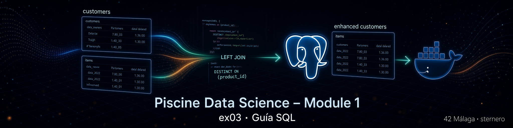

# 📘 Guía SQL – EX03 Fusion

<p align="center">
  
</p>

[← README EX03](./README.md) · [← Module 1](../README.md) · [python.md →](./python.md)

---

<a id="indice"></a>
## 📑 Índice

### Parte A – SQL desde cero (lo que necesitas antes de leer el script)
1. [¿Para quién es esta guía?](#para-quien)
2. [Qué es SQL (en lenguaje cotidiano)](#que-es-sql)
3. [Tabla, fila, columna](#tabla-fila-columna)
4. [SELECT: “enséñame datos”](#select)
5. [CREATE TABLE / DROP TABLE](#create-drop)
6. [Qué es un JOIN (la idea)](#join-idea)
7. [LEFT JOIN vs INNER JOIN (con ejemplo de tienda)](#left-vs-inner)
8. [NULL: “no hay dato”](#null)
9. [DISTINCT ON (PostgreSQL)](#distinct-on)
10. [AS: poner apodos a tablas y columnas](#as)

### Parte B – El subject y nuestro `fusion.sql`
11. [Qué pide exactamente el subject](#subject)
12. [Por qué fusionamos customers e items](#por-que)
13. [El script completo](#script-completo)
14. [Bloque 1: DROP TABLE IF EXISTS](#bloque1)
15. [Bloque 2: CREATE TABLE … AS SELECT](#bloque2)
16. [Bloque 3: LEFT JOIN y la subconsulta de items](#bloque3)
17. [Bloque 4: DROP + RENAME → tabla final `customers`](#bloque4)
18. [Cómo ejecutarlo](#ejecutar)
19. [Cómo comprobar que no se perdió información](#comprobar)
20. [Errores frecuentes](#errores)
21. [Glosario](#glosario)

---

<a id="para-quien"></a>
## 👋 ¿Para quién es esta guía?

Para cualquier persona de la piscine que:

- no haya programado SQL antes, o solo haya visto ejemplos sueltos;
- ya tenga las tablas **`customers`** (EX01–EX02) e **`items`** (Module 0);
- deba entender **línea a línea** el archivo `fusion.sql` sin dar nada por sentado.

No hace falta haber estudiado bases de datos en la universidad. Vamos con analogías de la vida diaria y después enlazamos cada idea con el código real.

[↑ Volver al índice](#indice)

---

<a id="que-es-sql"></a>
## 🗣️ Qué es SQL (en lenguaje cotidiano)

**SQL** (Structured Query Language) es el idioma con el que hablamos a una base de datos.

Analogía:

| En la vida real | En SQL |
|-----------------|--------|
| Preguntas al archivero del almacén | Consultas (`SELECT`, `JOIN`…) |
| Órdenes: “crea una estantería”, “tira esta caja” | `CREATE`, `DROP`, `DELETE`… |
| El almacén entero | La base de datos (`piscineds`) |

PostgreSQL es el motor (el “archivero automático”). Nosotros le escribimos órdenes en SQL; él las ejecuta.

[↑ Volver al índice](#indice)

---

<a id="tabla-fila-columna"></a>
## 📊 Tabla, fila, columna

Imagina una **hoja de cálculo**:

| product_id | brand   |
|------------|---------|
| 5712790    | f.o.x   |
| 5764655    | cnd     |

- **Tabla** = la hoja completa (ej. `items`, `customers`).
- **Columna** = una vertical (`brand`).
- **Fila** = una horizontal (un producto, o un evento de usuario).

En EX03:

- `customers` tiene muchas filas = muchos **eventos** (view, cart, …).
- `items` tiene filas = **fichas de producto** (categoría, marca).

[↑ Volver al índice](#indice)

---

<a id="select"></a>
## 🔍 SELECT: “enséñame datos”

```sql
SELECT * FROM customers LIMIT 5;
```

- `SELECT` = quiero ver…
- `*` = todas las columnas
- `FROM customers` = de esta tabla
- `LIMIT 5` = solo 5 filas (para no inundar la pantalla)

```sql
SELECT product_id, brand FROM items WHERE brand IS NOT NULL;
```

Aquí pedimos solo dos columnas y solo filas que tienen marca.

[↑ Volver al índice](#indice)

---

<a id="create-drop"></a>
## 🏗️ CREATE TABLE / DROP TABLE

```sql
CREATE TABLE prueba (id INTEGER, nombre VARCHAR(50));
```

Crea una tabla vacía con dos columnas.

```sql
DROP TABLE prueba;
```

La elimina por completo (estructura y datos).

```sql
DROP TABLE IF EXISTS prueba;
```

Igual, pero **no falla** si la tabla no existía (solo avisa). En nuestros scripts lo usamos para poder reejecutar sin miedo.

```sql
CREATE TABLE nueva AS SELECT * FROM vieja;
```

Crea `nueva` **copiando el resultado** de una consulta. Es lo que hacemos al materializar la fusión.

[↑ Volver al índice](#indice)

---

<a id="join-idea"></a>
## 🔗 Qué es un JOIN (la idea)

Tienes **dos listas** con algo en común.

Ejemplo cotidiano:

**Lista A – tickets de caja**

| ticket | codigo_producto |
|--------|-----------------|
| 1      | 100 |
| 2      | 200 |
| 3      | 999 |

**Lista B – catálogo**

| codigo_producto | marca |
|-----------------|-------|
| 100 | Nike |
| 200 | Adidas |

Un **JOIN** “pega” las listas usando `codigo_producto` como puente.

Resultado deseado:

| ticket | codigo_producto | marca |
|--------|-----------------|-------|
| 1 | 100 | Nike |
| 2 | 200 | Adidas |
| 3 | 999 | ¿? |

La pregunta del subject es: **¿qué hacemos con el ticket 3?**

[↑ Volver al índice](#indice)

---

<a id="left-vs-inner"></a>
## 📐 LEFT JOIN vs INNER JOIN (con ejemplo de tienda)

### INNER JOIN (“solo si hay pareja”)

```sql
FROM customers c
INNER JOIN items i ON c.product_id = i.product_id
```

Solo deja filas que existen en **ambas** tablas.  
El ticket 3 **desaparece**. Eso **pierde información** → no cumple el subject.

### LEFT JOIN (“la izquierda manda”)

```sql
FROM customers c
LEFT JOIN items i ON c.product_id = i.product_id
```

- Se conservan **todas** las filas de la tabla de la **izquierda** (`customers`).
- Si no hay match en `items`, las columnas de items quedan **NULL**.

```text
customers (izquierda)          items (derecha)
     ●──── match ────●
     ●──── match ────●
     ●  (sin match)      →  SE QUEDA (marca = NULL)
```

Analogía: pasas lista de alumnos (izquierda) y pegas la foto del carnet (derecha). Si alguien no tiene foto, **sigue en la lista** con el hueco vacío, no lo borras del aula.

[↑ Volver al índice](#indice)

---

<a id="null"></a>
## ⬜ NULL: “no hay dato”

`NULL` no es el texto `"null"` ni el número 0. Significa **ausencia de valor**.

```sql
WHERE brand IS NULL      -- sin marca
WHERE brand IS NOT NULL  -- con marca
```

Tras la fusión, es normal que algunas filas de `customers` tengan `category_id` / `brand` a NULL: el producto no estaba en el catálogo, pero el **evento se conserva**.

[↑ Volver al índice](#indice)

---

<a id="distinct-on"></a>
## 🧩 DISTINCT ON (PostgreSQL)

Si en `items` hubiera **dos filas** para el mismo `product_id`, un JOIN simple **multiplicaría** cada evento de ese producto (1 evento × 2 fichas = 2 filas). Inventaríamos historial.

```sql
SELECT DISTINCT ON (product_id)
    product_id, category_id, category_code, brand
FROM items
ORDER BY product_id;
```

- `DISTINCT ON (product_id)` = quédate con **una** fila por cada valor de `product_id`.
- `ORDER BY product_id` es obligatorio: la primera columna del `ORDER BY` debe ser la del `DISTINCT ON`.

Así el lado derecho del JOIN tiene **como máximo una ficha por producto**.

[↑ Volver al índice](#indice)

---

<a id="as"></a>
## 🏷️ AS: poner apodos

```sql
FROM customers AS c
LEFT JOIN items AS i ON c.product_id = i.product_id
```

`c` e `i` son **alias**: nombres cortos para no repetir `customers.` y `items.` en cada columna.  
`AS` es opcional en muchos motores (`FROM customers c` también vale); lo usamos por claridad.

[↑ Volver al índice](#indice)

---

<a id="subject"></a>
## 🎯 Qué pide exactamente el subject

Del PDF (Exercise 03 – fusion):

> You must combine the "customers" tables with "items" in the "customers" table  
> **Be careful not to lose any information**

| Requisito | Cómo lo cumplimos |
|-----------|-------------------|
| Combinar customers e items | `LEFT JOIN` por `product_id` |
| Resultado en `customers` | Tras el JOIN, `DROP` + `RENAME` a `customers` |
| No perder información | LEFT JOIN (no INNER) + no multiplicar filas (`DISTINCT ON`) |
| Entrega | `ex03/fusion.*` |

[↑ Volver al índice](#indice)

---

<a id="por-que"></a>
## 🧠 Por qué fusionamos

En un **Data Warehouse** quieres una tabla de hechos rica:

- Qué hizo el usuario (`event_type`, `event_time`…) → ya está en `customers`
- De qué producto hablamos (`brand`, categoría) → está en `items`

Fusionar = **una sola tabla** lista para analizar sin ir a buscar el catálogo cada vez.

[↑ Volver al índice](#indice)

---

<a id="script-completo"></a>
## 📜 El script completo

```sql
DROP TABLE IF EXISTS customers_fused;

CREATE TABLE customers_fused AS
SELECT
    c.event_time,
    c.event_type,
    c.product_id,
    c.price,
    c.user_id,
    c.user_session,
    i.category_id,
    i.category_code,
    i.brand
FROM customers AS c
LEFT JOIN (
    SELECT DISTINCT ON (product_id)
        product_id,
        category_id,
        category_code,
        brand
    FROM items
    ORDER BY product_id
) AS i
  ON c.product_id = i.product_id;

DROP TABLE customers;
ALTER TABLE customers_fused RENAME TO customers;
```

A continuación, cada bloque explicado.

[↑ Volver al índice](#indice)

---

<a id="bloque1"></a>
## 1️⃣ Bloque 1: DROP TABLE IF EXISTS

```sql
DROP TABLE IF EXISTS customers_fused;
```

- Borra una tabla de trabajo **si quedó** de un intento anterior.
- `IF EXISTS` evita el error “table does not exist” la primera vez.
- No toca aún la tabla real `customers`.

[↑ Volver al índice](#indice)

---

<a id="bloque2"></a>
## 2️⃣ Bloque 2: CREATE TABLE … AS SELECT

```sql
CREATE TABLE customers_fused AS
SELECT
    c.event_time,
    c.event_type,
    c.product_id,
    c.price,
    c.user_id,
    c.user_session,
    i.category_id,
    i.category_code,
    i.brand
FROM ...
```

- Crea **`customers_fused`** con el **resultado** del `SELECT`.
- Las seis primeras columnas vienen de **customers** (el evento).
- Las tres últimas vienen de **items** (el catálogo), o NULL si no hay match.

No hacemos el JOIN “en el aire” y ya: lo **materializamos** en una tabla nueva para luego sustituir el nombre con seguridad.

[↑ Volver al índice](#indice)

---

<a id="bloque3"></a>
## 3️⃣ Bloque 3: LEFT JOIN y la subconsulta de items

```sql
FROM customers AS c
LEFT JOIN (
    SELECT DISTINCT ON (product_id)
        product_id,
        category_id,
        category_code,
        brand
    FROM items
    ORDER BY product_id
) AS i
  ON c.product_id = i.product_id;
```

Paso a paso mental:

1. Parte de **todas** las filas de `customers` (`c`).
2. Prepara un “catálogo limpio” `i`: una sola fila por `product_id`.
3. Para cada evento, busca ficha con el mismo `product_id`.
4. Si la encuentra → rellena categoría y marca.
5. Si no → deja esas columnas a NULL **pero mantiene el evento**.

La condición de unión:

```sql
ON c.product_id = i.product_id
```

es el **puente** entre historial y catálogo.

[↑ Volver al índice](#indice)

---

<a id="bloque4"></a>
## 4️⃣ Bloque 4: DROP + RENAME

```sql
DROP TABLE customers;
ALTER TABLE customers_fused RENAME TO customers;
```

1. Elimina la `customers` antigua (solo eventos, sin catálogo).
2. Renombra `customers_fused` → **`customers`**.

El subject quiere la información **en la tabla customers**. Este patrón es el habitual en PostgreSQL cuando no hay un “REPLACE” de un solo paso.

⚠️ Orden importante: primero crear la nueva con éxito; **después** borrar la vieja. Si invirties te quedarías sin datos.

[↑ Volver al índice](#indice)

---

<a id="ejecutar"></a>
## ▶️ Cómo ejecutarlo

```bash
# Contenedor arriba
docker ps | grep postgres_piscineds

# Copiar y aplicar
docker cp fusion.sql postgres_piscineds:/tmp/fusion.sql
docker exec -it postgres_piscineds \
  psql -U "$(whoami)" -d piscineds -W -f /tmp/fusion.sql
```

O desde el menú de [`start.sh`](./start.sh) (opción SQL).

Con ~19 millones de filas puede tardar **varios minutos**. Es normal.

[↑ Volver al índice](#indice)

---

<a id="comprobar"></a>
## ✅ Cómo comprobar que no se perdió información

```sql
\d customers
-- Deben aparecer category_id, category_code, brand

SELECT COUNT(*) FROM customers;
-- Debe ser IGUAL al COUNT de customers justo ANTES de fusionar

SELECT COUNT(*) FILTER (WHERE category_id IS NULL) AS sin_match,
       COUNT(*) FILTER (WHERE category_id IS NOT NULL) AS con_match
FROM customers;

SELECT * FROM customers WHERE brand IS NOT NULL LIMIT 5;
```

| Comprobación | Significado |
|--------------|-------------|
| Mismo `COUNT(*)` | No se borraron eventos (LEFT JOIN OK) |
| Algunas filas con NULL | Productos sin ficha; **válido** |
| Columnas nuevas | La fusión incorporó el catálogo |

[↑ Volver al índice](#indice)

---

<a id="errores"></a>
## 🛠️ Errores frecuentes

| Síntoma | Causa | Qué hacer |
|---------|--------|-----------|
| `relation "customers" does not exist` | Falta EX01/EX02 | Crear y limpiar `customers` antes |
| `relation "items" does not exist` | Falta Module 0 EX04 | Cargar tabla `items` |
| `COUNT` **baja** tras fusionar | Se usó INNER JOIN | Usar este script (LEFT JOIN) |
| `COUNT` **sube** mucho | Varias filas por `product_id` en items | `DISTINCT ON` ya lo mitiga |
| `permission denied` / auth | Credenciales | Revisar `.env` de Module 0 |

[↑ Volver al índice](#indice)

---

<a id="glosario"></a>
## 📖 Glosario

| Término | Significado breve |
|---------|-------------------|
| SQL | Lenguaje para hablar con la base de datos |
| Tabla / fila / columna | Hoja / registro / campo |
| `SELECT` | Consultar datos |
| `CREATE TABLE AS` | Crear tabla a partir de una consulta |
| `DROP TABLE` | Eliminar tabla |
| `JOIN` | Combinar tablas por una condición |
| `LEFT JOIN` | Conserva todas las filas de la izquierda |
| `INNER JOIN` | Solo filas con pareja en ambas |
| `NULL` | Sin valor |
| `DISTINCT ON` | Una fila por valor de columna (PostgreSQL) |
| `AS` | Alias (apodo) |
| Data Warehouse | Almacén de datos preparado para análisis |

[↑ Volver al índice](#indice)

---

*Module 1 – EX03 – Guía SQL – sternero – 42 Málaga – 2026*
